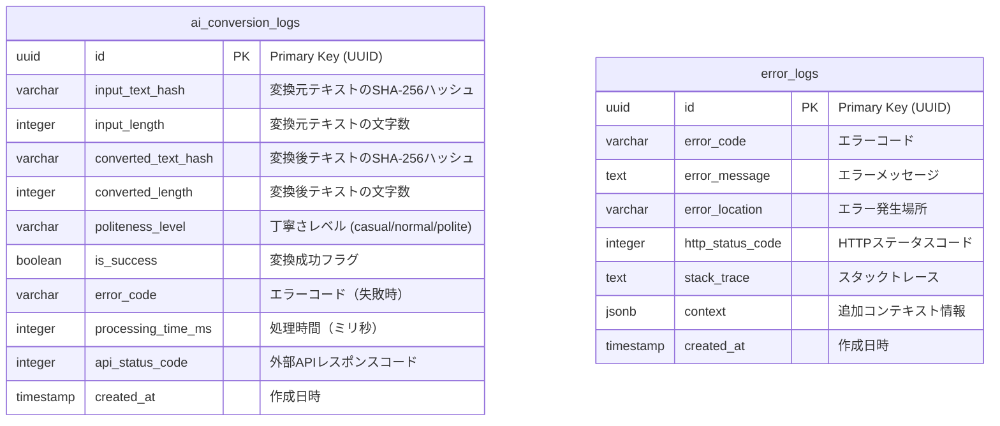

# kotonoha データベースER図

## 🔵 信頼性レベル

このER図は `database-schema.sql` に基づいて作成されています。

- 🟡 **黄信号**: EARS要件定義書・設計文書から妥当な推測によるスキーマ
  - AI変換ログとエラーログは将来的な拡張と統計用であり、MVP範囲で必須ではない

## ER図（MVP範囲）

## テーブル詳細説明

### ai_conversion_logs（AI変換ログテーブル）

**目的**: AI変換機能の使用状況・学習データ収集用（将来的な機能改善用）

**プライバシー保護**:
- 入力テキストと変換テキストはSHA-256ハッシュ化して保存
- 個人を特定できる情報は保存しない
- 統計用に文字数のみ記録

**主なカラム**:
- `input_text_hash`: 変換元テキストのハッシュ値（プライバシー保護）
- `converted_text_hash`: 変換後テキストのハッシュ値（プライバシー保護）
- `politeness_level`: 丁寧さレベル（casual/normal/polite）
- `processing_time_ms`: NFR-002（平均3秒以内）の監視用
- `is_success`: 変換成功/失敗フラグ
- `error_code`: エラー発生時のコード

**インデックス**:
- `idx_ai_conversion_logs_created_at`: 作成日時での検索用（降順）

**関連要件**:
- REQ-901: AI変換機能
- NFR-002: AI変換の応答時間を平均3秒以内
- NFR-101: ユーザーデータのプライバシー保護

---

### error_logs（エラーログテーブル）

**目的**: システムエラー・APIエラーの記録用（デバッグ・監視用）

**主なカラム**:
- `error_code`: エラーコード（システム全体で統一）
- `error_message`: エラーメッセージ
- `error_location`: エラー発生場所（モジュール名・関数名等）
- `http_status_code`: API関連エラーの場合のHTTPステータス
- `stack_trace`: スタックトレース（開発環境のみ保存推奨）
- `context`: 追加のコンテキスト情報（JSON形式、柔軟な情報保存）

**インデックス**:
- `idx_error_logs_code_created`: エラーコードと作成日時での検索用
- `idx_error_logs_created_at`: 作成日時での検索用（降順）

**関連要件**:
- NFR-304: データベースエラー発生時に適切なエラーハンドリング
- NFR-301: 重大なエラーが発生しても基本機能を継続利用可能に保つ

---

## 将来的な拡張テーブル（MVP範囲外）

以下のテーブルは `database-schema.sql` にコメントアウトして記載されています：

### users（ユーザーテーブル）
- **用途**: アカウント管理機能用
- **MVP範囲**: 実装不要（アカウント管理機能はMVP範囲外）

### preset_phrases_cloud（定型文同期テーブル）
- **用途**: クラウド同期機能用
- **MVP範囲**: 実装不要（クラウド同期はMVP範囲外）

### favorites_cloud（お気に入り同期テーブル）
- **用途**: クラウド同期機能用
- **MVP範囲**: 実装不要（クラウド同期はMVP範囲外）

### usage_statistics（統計情報テーブル）
- **用途**: 利用状況分析用
- **MVP範囲**: 実装不要（詳細な統計分析はMVP範囲外）

---

## データ保持ポリシー

### AI変換ログ
- **保持期間**: 90日
- **削除方法**: cronジョブまたはpg_cronで自動削除

### エラーログ
- **保持期間**: 30日
- **削除方法**: cronジョブまたはpg_cronで自動削除

---

## セキュリティとパフォーマンス

### プライバシー保護
- AI変換の入力/出力テキストはSHA-256ハッシュ化
- 個人を特定できる情報は保存しない
- 統計用途のみで使用

### パフォーマンス最適化
- 適切なインデックス設定（created_at降順、error_code）
- autovacuum機能の有効化
- 定期的なVACUUM ANALYZE（自動実行）

### 権限設定
- アプリケーション用ロール: SELECT, INSERT権限のみ
- 読み取り専用ロール: 監視・分析用（本番環境）

---

## 注意事項

1. **ユーザーデータは端末内ローカル保存**: 定型文・履歴・お気に入り・設定はすべてFlutter側のHiveに保存（NFR-101）
2. **PostgreSQLは最小限の利用**: バックエンドAPIの内部処理用のみ
3. **MVP範囲では最小構成**: ai_conversion_logs、error_logsのみ実装
4. **将来拡張性を確保**: users、クラウド同期テーブル等はコメントアウトして準備

---

## 関連ドキュメント

- [データベーススキーマSQL](./database-schema.sql)
- [アーキテクチャ設計](./architecture.md)
- [データフロー図](./dataflow.md)
- [API仕様](./api-endpoints.md)
- [要件定義書](../../spec/kotonoha-requirements.md)

---

## 更新履歴

- **2025-11-20**: 初回作成（TASK-0006により作成）
  - MVP範囲のER図作成
  - テーブル詳細説明追加
  - 将来拡張テーブルの記載
