# データフロー図

## 🔵 信頼性レベル凡例

- 🔵 **青信号**: EARS要件定義書・設計文書を参考にした確実なフロー
- 🟡 **黄信号**: EARS要件定義書・設計文書から妥当な推測によるフロー
- 🔴 **赤信号**: EARS要件定義書・設計文書にない推測によるフロー

## システム全体のアーキテクチャフロー 🔵

```mermaid
flowchart TB
    subgraph Client["Flutter クライアント（iOS/Android/Web）"]
        UI[UI Layer<br/>文字盤・定型文・大ボタン等]
        State[状態管理 Riverpod]
        LocalStorage[ローカルストレージ<br/>Hive + shared_preferences]
        TTS[OS標準TTS]
    end

    subgraph Backend["FastAPI バックエンド（オプション）"]
        API[API Gateway]
        AIProxy[AI変換プロキシ]
        DB[(PostgreSQL<br/>将来的な拡張用)]
    end

    subgraph External["外部サービス"]
        AIAPI[AI API<br/>Claude/GPT等]
    end

    UI --> State
    State --> LocalStorage
    State --> TTS
    State --> API
    API --> AIProxy
    AIProxy --> AIAPI
    AIProxy --> DB
```

## ユーザーインタラクションフロー 🔵

### 基本コミュニケーションフロー（オフライン動作）

```mermaid
flowchart TD
    Start([ユーザー起動])
    Start --> LoadState[前回の状態を復元]
    LoadState --> MainScreen[メイン画面表示]

    MainScreen --> Input{操作選択}

    Input -->|文字盤タップ| CharInput[文字入力バッファに追加]
    Input -->|定型文選択| PresetSelect[定型文を入力欄に反映]
    Input -->|大ボタンタップ| QuickBtn[即座に読み上げ]
    Input -->|履歴選択| HistorySelect[履歴から選択]

    CharInput --> SpeakBtn{読み上げボタン}
    PresetSelect --> SpeakBtn
    HistorySelect --> SpeakBtn

    SpeakBtn -->|タップ| TTSPlay[OS標準TTSで読み上げ]
    QuickBtn --> TTSPlay

    TTSPlay --> SaveHistory[履歴に自動保存<br/>ローカルストレージ]
    SaveHistory --> MainScreen
```

### AI変換フロー（オンライン時） 🔵

```mermaid
sequenceDiagram
    participant U as ユーザー
    participant UI as Flutter UI
    participant State as Riverpod State
    participant API as FastAPI Backend
    participant AI as 外部AI API

    U->>UI: 短い文章を入力<br/>例: 「水 ぬるく」
    UI->>State: 入力完了イベント

    State->>State: ネットワーク接続確認

    alt オンライン
        State->>UI: ローディング表示
        State->>API: AI変換リクエスト<br/>POST /ai/convert
        API->>AI: プロンプト生成・送信
        AI-->>API: 変換結果返却
        API-->>State: 変換候補返却
        State->>UI: 変換結果表示<br/>「お水をぬるめでお願いします」
        U->>UI: 採用/再生成/元の文を使う

        alt 採用
            UI->>State: 変換結果を入力欄に反映
        else 再生成
            UI->>State: 再度AI変換リクエスト
        else 元の文を使う
            UI->>State: 元の入力をそのまま使用
        end
    else オフライン
        State->>UI: AI変換無効化表示<br/>「オフラインでは利用できません」
        UI->>State: 元の文をそのまま使用
    end
```

### 緊急呼び出しフロー 🔵

```mermaid
flowchart TD
    Start([緊急ボタン表示])
    Start --> Tap1[緊急ボタン 1回目タップ]
    Tap1 --> Dialog[確認ダイアログ表示<br/>「緊急呼び出しを実行しますか？」]

    Dialog --> Choice{ユーザー選択}

    Choice -->|いいえ| Cancel[ダイアログ閉じる]
    Cancel --> Start

    Choice -->|はい| Confirm[2回目確認完了]
    Confirm --> EmergencySound[緊急音を再生<br/>大音量・連続音]
    Confirm --> ScreenRed[画面全体を赤く表示<br/>視覚的警告]

    EmergencySound --> Alert[周囲の人が駆けつける]
    ScreenRed --> Alert

    Alert --> Reset[リセットボタンで<br/>通常画面に戻る]
```

### 定型文管理フロー 🔵

```mermaid
flowchart TD
    Start([定型文画面表示])
    Start --> Load[ローカルストレージから<br/>定型文読み込み]
    Load --> Display[定型文一覧表示<br/>お気に入り優先・カテゴリ別]

    Display --> Action{操作選択}

    Action -->|定型文タップ| Instant[即座に読み上げ]
    Action -->|定型文長押し| Menu[メニュー表示<br/>編集/削除/お気に入り]
    Action -->|追加ボタン| Add[新規定型文作成]

    Instant --> TTSPlay[OS標準TTS読み上げ]
    TTSPlay --> SaveHistory[履歴に保存]

    Menu --> Edit{メニュー選択}
    Edit -->|編集| EditForm[編集フォーム表示]
    Edit -->|削除| ConfirmDelete[削除確認ダイアログ]
    Edit -->|お気に入り切替| ToggleFav[お気に入り状態変更]

    EditForm --> SaveLocal[ローカルストレージに保存]
    ConfirmDelete -->|はい| DeleteLocal[ローカルストレージから削除]
    ToggleFav --> SaveLocal

    Add --> AddForm[追加フォーム表示]
    AddForm --> SaveLocal

    SaveLocal --> Reload[定型文一覧再読み込み]
    DeleteLocal --> Reload
    Reload --> Display
```

### 履歴・お気に入り管理フロー 🔵

```mermaid
flowchart TD
    Start([履歴/お気に入り画面])
    Start --> Load[ローカルストレージから読み込み]
    Load --> Check{データ確認}

    Check -->|0件| Empty[「履歴がありません」<br/>または<br/>「お気に入りがありません」]
    Check -->|1件以上| Display[一覧表示<br/>最新順・時系列]

    Display --> Action{操作選択}

    Action -->|項目タップ| Reuse[再度読み上げ]
    Action -->|お気に入り追加| AddFav[お気に入りに登録]
    Action -->|削除| ConfirmDelete[削除確認ダイアログ]
    Action -->|全削除| ConfirmDeleteAll[全削除確認ダイアログ]

    Reuse --> TTSPlay[OS標準TTS読み上げ]
    TTSPlay --> SaveHistory[履歴に追加保存]

    AddFav --> SaveFav[お気に入りに保存<br/>ローカルストレージ]
    SaveFav --> Display

    ConfirmDelete -->|はい| DeleteItem[項目削除<br/>ローカルストレージ]
    ConfirmDeleteAll -->|はい| DeleteAll[全削除<br/>ローカルストレージ]

    DeleteItem --> Reload[一覧再読み込み]
    DeleteAll --> Reload
    Reload --> Check

    SaveHistory --> AutoLimit{履歴件数確認}
    AutoLimit -->|50件以下| Display
    AutoLimit -->|51件以上| AutoDelete[最も古い履歴を<br/>自動削除]
    AutoDelete --> Display
```

## データ処理フロー 🔵

### 文字盤入力処理

```mermaid
sequenceDiagram
    participant U as ユーザー
    participant UI as 文字盤UI
    participant State as 入力状態管理
    participant Buffer as 入力バッファ
    participant Validation as バリデーション

    U->>UI: 文字「あ」をタップ
    UI->>State: タップイベント発火
    State->>Validation: 入力可否チェック<br/>（文字数上限確認）

    alt 1000文字未満
        Validation->>Buffer: 文字追加「あ」
        Buffer->>State: 更新通知
        State->>UI: 入力欄更新表示<br/>「あ」
        UI->>U: 視覚的フィードバック<br/>（100ms以内）
    else 1000文字以上
        Validation->>UI: 警告表示<br/>「文字数上限に達しました」
    end
```

### TTS読み上げ処理

```mermaid
sequenceDiagram
    participant U as ユーザー
    participant UI as 読み上げボタン
    participant State as 状態管理
    participant TTS as OS標準TTS
    participant Vol as OS音量確認
    participant History as 履歴保存

    U->>UI: 読み上げボタンタップ
    UI->>State: 読み上げリクエスト
    State->>Vol: OS音量確認

    alt 音量0
        Vol->>UI: 警告表示<br/>「音量が0です」
    else 音量あり
        Vol->>TTS: 読み上げ開始リクエスト
        TTS->>State: 読み上げ中状態
        State->>UI: ボタン表示変更<br/>「停止」ボタン
        TTS->>U: 音声再生<br/>（1秒以内に開始）

        par 並行処理
            TTS->>State: 読み上げ完了通知
            State->>UI: ボタン表示変更<br/>「読み上げ」ボタン
        and
            State->>History: 履歴に自動保存<br/>ローカルストレージ
        end
    end
```

### 対面表示モード切り替え

```mermaid
flowchart TD
    Start([通常モード])
    Start --> FaceBtn[対面表示ボタンタップ]
    FaceBtn --> EnlargeText[テキストを画面中央に拡大表示]
    FaceBtn --> SimplifyBG[背景をシンプルに]

    EnlargeText --> FaceMode[対面表示モード]
    SimplifyBG --> FaceMode

    FaceMode --> RotateCheck{画面回転ボタン}
    RotateCheck -->|タップ| Rotate180[画面を180度回転<br/>相手側から正しい向き]
    Rotate180 --> FaceMode

    FaceMode --> BackBtn[通常モードに戻るボタンタップ]
    BackBtn --> Start
```

## ネットワーク接続状態管理 🔵

```mermaid
stateDiagram-v2
    [*] --> Checking: アプリ起動

    Checking --> Online: ネットワーク接続あり
    Checking --> Offline: ネットワーク接続なし

    Online --> AI_Available: AI変換機能有効
    Offline --> AI_Disabled: AI変換機能無効

    AI_Available --> Processing: AI変換リクエスト
    Processing --> Success: 変換成功
    Processing --> Error: 変換失敗・タイムアウト
    Processing --> Offline: ネットワーク切断

    Success --> AI_Available
    Error --> Fallback: 元の文を使用
    Fallback --> AI_Available

    AI_Disabled --> Offline
    Offline --> Checking: 定期的な接続確認<br/>（30秒ごと）

    Online --> Offline: ネットワーク切断検知
    Offline --> Online: ネットワーク復旧検知
```

## エラーハンドリングフロー 🔵

### AI変換エラー処理

```mermaid
flowchart TD
    Start([AI変換リクエスト])
    Start --> Network{ネットワーク<br/>接続確認}

    Network -->|オフライン| OfflineMsg[「オフラインでは<br/>利用できません」]
    OfflineMsg --> Fallback1[元の文を使用]

    Network -->|オンライン| SendAPI[FastAPI Backendに送信]
    SendAPI --> Timeout{応答時間確認}

    Timeout -->|3秒以内| Response{レスポンス<br/>ステータス}
    Timeout -->|3秒超過| Loading[ローディング表示]
    Loading --> Timeout

    Response -->|200 OK| DisplayResult[変換結果表示]
    Response -->|4xx/5xx| APIError[「変換に失敗しました」]
    Response -->|タイムアウト| TimeoutError[「応答がありません」]

    APIError --> Fallback2[元の文を使用<br/>再試行オプション提供]
    TimeoutError --> Fallback2

    DisplayResult --> UserChoice{ユーザー選択}
    UserChoice -->|採用| Success([変換結果を入力欄に反映])
    UserChoice -->|元の文| Fallback3([元の文を使用])
    UserChoice -->|再生成| Start
```

### データ保存エラー処理

```mermaid
flowchart TD
    Start([データ保存リクエスト])
    Start --> Storage{ストレージ容量確認}

    Storage -->|十分な容量| Save[ローカルストレージに保存<br/>Hive]
    Storage -->|容量不足| Warning[警告表示<br/>「容量が不足しています」]

    Warning --> Suggest[古い履歴を削除する<br/>提案を表示]
    Suggest --> UserChoice{ユーザー選択}

    UserChoice -->|削除する| AutoDelete[最も古い履歴を削除]
    UserChoice -->|キャンセル| Abort[保存中止]

    AutoDelete --> Retry[再度保存試行]
    Retry --> Storage

    Save --> Verify{保存確認}
    Verify -->|成功| Success([保存完了])
    Verify -->|失敗| Error[エラーログ記録]
    Error --> Retry2[リトライ（最大3回）]
    Retry2 --> Storage
```

## 状態管理フロー（Riverpod） 🟡

```mermaid
flowchart TD
    subgraph Providers["Riverpod Providers"]
        InputProvider[入力状態Provider<br/>StateNotifier]
        PresetProvider[定型文Provider<br/>FutureProvider]
        HistoryProvider[履歴Provider<br/>StateNotifier]
        FavoriteProvider[お気に入りProvider<br/>StateNotifier]
        SettingsProvider[設定Provider<br/>StateNotifier]
        AIProvider[AI変換Provider<br/>FutureProvider]
        NetworkProvider[ネットワーク状態Provider<br/>StateNotifier]
    end

    subgraph Storage["ローカルストレージ"]
        Hive[Hive Database<br/>定型文・履歴・お気に入り]
        SharedPrefs[shared_preferences<br/>設定]
    end

    subgraph UI["UI Components"]
        CharPad[文字盤]
        PresetList[定型文一覧]
        HistoryList[履歴一覧]
        Settings[設定画面]
    end

    CharPad --> InputProvider
    PresetList --> PresetProvider
    HistoryList --> HistoryProvider
    Settings --> SettingsProvider

    InputProvider --> AIProvider
    AIProvider --> NetworkProvider

    PresetProvider --> Hive
    HistoryProvider --> Hive
    FavoriteProvider --> Hive
    SettingsProvider --> SharedPrefs

    Hive --> PresetProvider
    Hive --> HistoryProvider
    Hive --> FavoriteProvider
    SharedPrefs --> SettingsProvider
```

## データ同期フロー（将来拡張） 🔴

**注**: MVP範囲外、将来的な拡張として検討

```mermaid
sequenceDiagram
    participant Local as ローカルDB<br/>Hive
    participant App as Flutter App
    participant Backend as FastAPI Backend
    participant Cloud as クラウドDB<br/>PostgreSQL

    Note over App: ユーザーがログインした場合のみ

    App->>Backend: ログイン認証<br/>JWT取得
    Backend-->>App: JWT トークン

    App->>Local: ローカルデータ読み込み
    Local-->>App: 定型文・お気に入り

    App->>Backend: データ同期リクエスト<br/>（JWT + ローカルデータ）
    Backend->>Cloud: クラウドデータと比較
    Cloud-->>Backend: 差分データ
    Backend-->>App: 同期データ返却

    App->>Local: ローカルデータ更新
    App->>Backend: ローカル変更をアップロード
    Backend->>Cloud: クラウドデータ更新
```

## パフォーマンス最適化フロー 🟡

### 文字盤タップ応答時間の最適化（100ms以内）

```mermaid
flowchart LR
    Tap[タップイベント] --> Debounce[デバウンス処理<br/>連続タップ防止]
    Debounce --> Update[状態即時更新<br/>Riverpod]
    Update --> Render[UI再描画<br/>Flutter Widget]
    Render --> Feedback[視覚的フィードバック<br/>アニメーション]

    Note[目標: 100ms以内] --> Render
```

### 定型文一覧の高速表示（1秒以内）

```mermaid
flowchart LR
    Open[画面遷移] --> LoadCache[キャッシュチェック<br/>Riverpod]
    LoadCache --> HitCache{キャッシュあり?}

    HitCache -->|あり| InstantDisplay[即座に表示<br/>100ms以内]
    HitCache -->|なし| LoadHive[Hiveから読み込み]

    LoadHive --> Parse[データパース]
    Parse --> Display[一覧表示<br/>1秒以内]
    Display --> Cache[キャッシュに保存]
```
