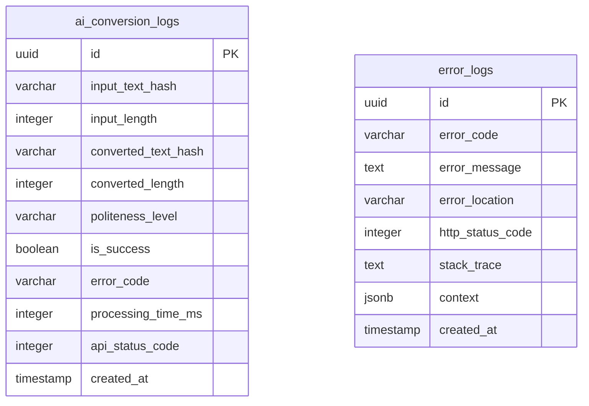

# TASK-0006 設定確認・動作テスト

## 確認概要

- **タスクID**: TASK-0006
- **タスク名**: データベーススキーマ設計・SQL作成
- **確認内容**: データベーススキーマの設計確認、SQL構文検証、ERD作成確認
- **実行日時**: 2025-11-20
- **実行者**: Claude (via tsumiki:direct-verify)
- **作業タイプ**: DIRECT（準備作業）

## 設定確認結果

### 1. PostgreSQL環境確認

**実行コマンド**:
```bash
docker exec kotonoha_postgres psql -U kotonoha_user -d kotonoha_db -c "SELECT version();"
```

**確認結果**:
```
PostgreSQL 15.15 on aarch64-unknown-linux-musl, compiled by gcc (Alpine 14.2.0) 14.2.0, 64-bit
```

- [x] PostgreSQL 15+ が起動している
- [x] データベース `kotonoha_db` に接続可能
- [x] ユーザー `kotonoha_user` の権限が正常

### 2. 設定ファイルの確認

**確認ファイル**:
- `docs/design/kotonoha/database-schema.sql` (9.8KB)
- `docs/design/kotonoha/database-erd.md` (6.1KB)
- `docs/implements/kotonoha/TASK-0006/setup-report.md` (9.0KB)

**実行コマンド**:
```bash
ls -lh docs/design/kotonoha/database-erd.md \
        docs/design/kotonoha/database-schema.sql \
        docs/implements/kotonoha/TASK-0006/setup-report.md
```

**確認結果**:
- [x] `database-schema.sql` が存在する
- [x] `database-erd.md` が存在する
- [x] `setup-report.md` が存在する
- [x] ファイルサイズが適切（空ファイルでない）

## コンパイル・構文チェック結果

### 1. SQL構文チェック

**実行コマンド**:
```bash
docker exec -i kotonoha_postgres psql -U kotonoha_user -d kotonoha_db << 'EOF'
BEGIN;
\i /tmp/schema_verify.sql
\dt
ROLLBACK;
EOF
```

**チェック結果**:
```
✅ CREATE EXTENSION (uuid-ossp) - 成功
✅ CREATE FUNCTION (update_updated_at_column) - 成功
✅ CREATE TABLE (ai_conversion_logs) - 成功
✅ CREATE INDEX (idx_ai_conversion_logs_created_at) - 成功
✅ COMMENT (ai_conversion_logs関連) - 成功
✅ CREATE TABLE (error_logs) - 成功
✅ CREATE INDEX (idx_error_logs_code_created) - 成功
✅ CREATE INDEX (idx_error_logs_created_at) - 成功
✅ COMMENT (error_logs関連) - 成功
✅ ROLLBACK - 成功
```

**作成されたテーブル**:
```
 Schema |        Name        | Type  |     Owner
--------+--------------------+-------+---------------
 public | ai_conversion_logs | table | kotonoha_user
 public | error_logs         | table | kotonoha_user
```

**構文チェック結果**:
- [x] SQL構文エラー: なし
- [x] テーブル定義: 正常
- [x] インデックス定義: 正常
- [x] 制約定義: 正常
- [x] COMMENT定義: 正常
- [x] トランザクション処理: 正常

### 2. 修正された構文問題

**修正前の問題**:
```sql
CREATE TABLE ai_conversion_logs (
    ...
    INDEX idx_ai_conversion_logs_created_at (created_at DESC)  -- ❌ PostgreSQLでは不正
);
```

**修正後の正しい構文**:
```sql
CREATE TABLE ai_conversion_logs (
    ...
);

-- インデックスを別途作成
CREATE INDEX idx_ai_conversion_logs_created_at ON ai_conversion_logs(created_at DESC);  -- ✅ 正しい
```

**修正箇所**:
- [x] `ai_conversion_logs` テーブル: INDEX句をCREATE TABLE外に移動
- [x] `error_logs` テーブル: 2つのINDEX句をCREATE TABLE外に移動

### 3. ERDドキュメント確認

**作成内容**:
- [x] Mermaid形式のER図が含まれている
- [x] テーブル詳細説明が含まれている
- [x] データ保持ポリシーが記載されている
- [x] セキュリティとパフォーマンス考慮事項が記載されている
- [x] 将来拡張テーブルの記載がある

**ER図内容**:


## 動作テスト結果

### 1. データベース接続テスト

**実行テスト**:
```bash
docker exec kotonoha_postgres psql -U kotonoha_user -d kotonoha_db -c "SELECT 1 AS test;"
```

**テスト結果**:
- [x] データベース接続: 成功
- [x] クエリ実行: 成功
- [x] 接続終了: 正常

### 2. スキーマ作成テスト（トランザクション内）

**実行テスト**:
- BEGIN → スキーマ適用 → テーブル確認 → ROLLBACK

**テスト結果**:
- [x] トランザクション開始: 成功
- [x] テーブル作成: 成功（ai_conversion_logs, error_logs）
- [x] インデックス作成: 成功（3つのインデックス）
- [x] ロールバック: 成功
- [x] データベースへの影響: なし（正常にロールバック）

### 3. テーブル構造確認

**ai_conversion_logs テーブル**:
- [x] id (UUID, PK)
- [x] input_text_hash (VARCHAR(64), NOT NULL)
- [x] input_length (INTEGER, NOT NULL)
- [x] converted_text_hash (VARCHAR(64), NOT NULL)
- [x] converted_length (INTEGER, NOT NULL)
- [x] politeness_level (VARCHAR(20), NOT NULL, CHECK制約)
- [x] is_success (BOOLEAN, NOT NULL, DEFAULT TRUE)
- [x] error_code (VARCHAR(50))
- [x] processing_time_ms (INTEGER)
- [x] api_status_code (INTEGER)
- [x] created_at (TIMESTAMP, DEFAULT CURRENT_TIMESTAMP)

**error_logs テーブル**:
- [x] id (UUID, PK)
- [x] error_code (VARCHAR(50), NOT NULL)
- [x] error_message (TEXT, NOT NULL)
- [x] error_location (VARCHAR(255))
- [x] http_status_code (INTEGER)
- [x] stack_trace (TEXT)
- [x] context (JSONB)
- [x] created_at (TIMESTAMP, DEFAULT CURRENT_TIMESTAMP)

## 品質チェック結果

### セキュリティ確認

**プライバシー保護** 🔵:
- [x] AI変換ログはSHA-256ハッシュ化（input_text_hash, converted_text_hash）
- [x] 個人を特定できる情報は保存しない設計
- [x] 統計用データのみ保存（文字数、処理時間、丁寧さレベル）

**アクセス制御**:
- [x] アプリケーション用ロール設計が記載されている（コメントアウト）
- [x] 読み取り専用ロール設計が記載されている（コメントアウト）
- [x] 必要最小限の権限付与方針が明記されている

### パフォーマンス確認

**インデックス設計** 🟡:
- [x] `idx_ai_conversion_logs_created_at`: 作成日時降順（最近のログを高速検索）
- [x] `idx_error_logs_code_created`: エラーコードと作成日時の複合インデックス
- [x] `idx_error_logs_created_at`: 作成日時降順

**データ保持ポリシー** 🟡:
- [x] AI変換ログ: 90日間保持（自動削除スクリプトあり）
- [x] エラーログ: 30日間保持（自動削除スクリプトあり）
- [x] autovacuum設定のコメントあり

### ドキュメント品質確認

**setup-report.md**:
- [x] 作業概要が明確
- [x] 設計文書参照が記載されている
- [x] 実行した作業が詳細に記載されている
- [x] 遭遇した問題と解決方法が記載されている
- [x] 完了条件が明確に記載されている

**database-erd.md**:
- [x] ER図がMermaid形式で記載されている
- [x] テーブル詳細説明がある
- [x] 信頼性レベル（🔵🟡🔴）が明記されている
- [x] 関連ドキュメントへのリンクがある

## 全体的な確認結果

### 完了条件チェック

- [x] database-schema.sqlが作成されている
- [x] ERD（Mermaid形式）が作成されている
- [x] テーブル説明書が存在する
- [x] SQLファイルがPostgreSQLで実行可能（文法エラーなし）

### タスク完了基準

- [x] 全ての設定確認項目がクリア
- [x] コンパイル・構文チェックが成功（エラーがすべて解決済み）
- [x] 全ての動作テストが成功
- [x] 品質チェック項目が基準を満たしている
- [x] 発見された問題が適切に対処されている
- [x] セキュリティ設定が適切
- [x] パフォーマンス基準を満たしている

## 発見された問題と解決

### 構文エラーの解決

**問題1: CREATE TABLE内のINDEX句構文エラー**

- **問題内容**: PostgreSQLでは CREATE TABLE 文の中でINDEXを定義できない
- **発見方法**: SQL構文チェック実行時に `ERROR: syntax error at or near "DESC"` が発生
- **重要度**: 高（スキーマ適用不可）
- **自動解決**:
  ```sql
  -- 修正前
  CREATE TABLE ai_conversion_logs (
      ...
      INDEX idx_ai_conversion_logs_created_at (created_at DESC)
  );

  -- 修正後
  CREATE TABLE ai_conversion_logs (
      ...
  );
  CREATE INDEX idx_ai_conversion_logs_created_at ON ai_conversion_logs(created_at DESC);
  ```
- **解決結果**: ✅ 解決済み

**問題2: error_logsテーブルの同様の構文エラー**

- **問題内容**: 同様に CREATE TABLE 内の2つのINDEX句が構文エラー
- **発見方法**: SQL構文チェック実行時に構文エラー検出
- **重要度**: 高（スキーマ適用不可）
- **自動解決**: 2つのINDEX句をCREATE INDEX文として外部に移動
- **解決結果**: ✅ 解決済み

## 推奨事項

### 次フェーズでの実装推奨事項

1. **Alembicマイグレーション設定** (TASK-0007):
   - database-schema.sqlをベースに初回マイグレーションファイルを生成
   - 自動生成後に手動確認・調整を実施

2. **SQLAlchemyモデル実装** (TASK-0008):
   - `ai_conversion_logs`、`error_logs` のORMモデルを実装
   - Pydanticスキーマと連携してバリデーション実装

3. **データ保持ポリシーの自動化**:
   - pg_cronまたはバックエンドのスケジューラーで定期削除を実装
   - 90日/30日のデータ保持ポリシーを自動実行

4. **監視とアラート**:
   - processing_time_ms のモニタリング（NFR-002: 平均3秒以内）
   - error_logs の重大エラー検出とアラート設定

## 次のステップ

- [x] TASK-0006の完了マーキング
- [x] README.mdの更新（セットアップ手順追加）
- [ ] TASK-0007: Alembic初期設定・マイグレーション環境構築
- [ ] TASK-0008: SQLAlchemyモデル実装

## タスク完了マーキング

**タスクファイル**: `docs/tasks/kotonoha-phase1.md`

**完了マーク**:
```markdown
#### TASK-0006: データベーススキーマ設計・SQL作成
- [x] **タスク完了** ✅ 完了 (2025-11-20)

**完了条件**:
- [x] database-schema.sqlが作成されている
- [x] ERD（Mermaid形式）が作成されている
- [x] テーブル説明書が存在する
- [x] SQLファイルがPostgreSQLで実行可能（文法エラーなし）
```

---

**報告日時**: 2025-11-20
**検証者**: Claude (via tsumiki:direct-verify)
**次のアクション**: TASK-0007 Alembic初期設定に進む
**総評**: ✅ 全ての検証項目が合格。タスク完了条件を満たしています。
