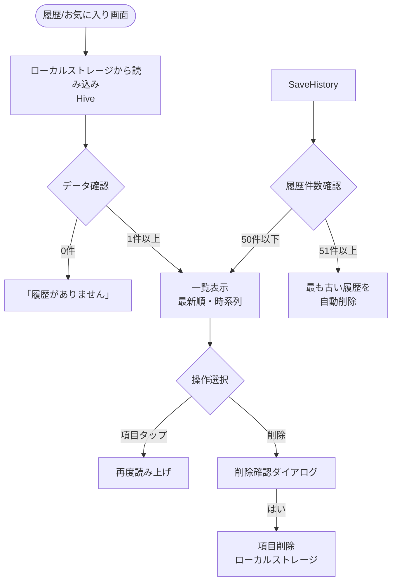

# TDD要件定義・機能仕様 - TASK-0014: Hiveローカルストレージセットアップ・データモデル実装

## タスク情報

- **タスクID**: TASK-0014
- **タスク名**: Hiveローカルストレージセットアップ・データモデル実装
- **タスクタイプ**: TDD
- **推定工数**: 8時間
- **フェーズ**: Phase 1 - Week 3, Day 14
- **依存タスク**: TASK-0013 (Riverpod状態管理セットアップ・プロバイダー基盤実装)

## 関連文書

- **EARS要件定義書**: [docs/spec/kotonoha-requirements.md](../../spec/kotonoha-requirements.md)
- **アーキテクチャ設計**: [docs/design/kotonoha/architecture.md](../../design/kotonoha/architecture.md)
- **データフロー図**: [docs/design/kotonoha/dataflow.md](../../design/kotonoha/dataflow.md)
- **Dart型定義**: [docs/design/kotonoha/interfaces.dart](../../design/kotonoha/interfaces.dart)
- **Phase 1タスク**: [docs/tasks/kotonoha-phase1.md](../../tasks/kotonoha-phase1.md)

---

## 1. 機能の概要（EARS要件定義書・設計文書ベース）

### 🔵 機能概要
この機能は、Flutterアプリケーションでローカルデータ永続化のためのHiveデータベースをセットアップし、履歴データと定型文データを保存・取得するためのデータモデル（TypeAdapter）を実装します。

### 何をする機能か
- Hiveデータベースの初期化処理を実装
- `HistoryItem`データモデル（TypeAdapter）を実装
- `PresetPhrase`データモデル（TypeAdapter）を実装
- Hiveボックスのオープン・クローズ処理を実装
- main.dartへのHive初期化統合
- コード生成（hive_generator）の実行
- データの保存・読み込み・削除の基本操作を実装

### どのような問題を解決するか
**🔵 オフラインファースト設計の実現**:
- REQ-1001: 文字盤入力・定型文・履歴・TTSをオフライン環境で利用可能にする
- REQ-601: 読み上げまたは表示した文章を自動的に履歴として保存する
- REQ-5003: アプリが強制終了しても定型文・設定・履歴を失わない永続化機構を実装する
- architecture.md「オフラインファースト設計」: 基本機能はすべてオフラインで動作、ユーザーデータは端末内ローカル保存

**🔵 プライバシー重視のデータ保存**:
- NFR-101: 利用者の会話内容（定型文・履歴）を原則として端末内にのみ保存
- architecture.md「データ保存ポリシー」: アプリ専用領域に保存、他アプリからアクセス不可

**🔵 高速なデータアクセス**:
- NFR-004: 定型文一覧の表示（100件程度）を1秒以内に完了
- Hiveは軽量・高速なNoSQLデータベースで、SharedPreferencesよりも複雑なデータ構造に適している

### 想定されるユーザー
- 発話が困難な方（脳梗塞・ALS・筋疾患など）
- 同じ端末を継続して使用し、過去の履歴や定型文を再利用したいユーザー
- ネットワーク接続が不安定な環境でアプリを使用するユーザー

### システム内での位置づけ
**🔵 アーキテクチャ上の位置**:
- **データ永続化層**: Riverpod状態管理の下位層として、ローカルデータの永続化を担当
- **architecture.md「ローカルストレージ」セクション参照**（40行目）:
  - shared_preferences: シンプルなkey-value保存（設定用）
  - **Hive**: ローカルデータベース（定型文・履歴・お気に入り用）
- **dataflow.md「基本コミュニケーションフロー」セクション参照**（87-96行目）:
  ```
  [文字盤UI] → [ローカル入力バッファ] → [TTS（OS標準）] → 読み上げ
    ↓
  [ローカルストレージ（Hive）] ← 履歴保存
  ```

### 参照したEARS要件
- **REQ-601**: システムは読み上げまたは表示した文章を自動的に履歴として保存しなければならない 🔵
- **REQ-602**: システムは履歴を最大50件まで保持し、古いものから自動削除しなければならない 🔵
- **REQ-605**: システムは履歴をローカル端末内のみに保存しなければならない 🔵
- **REQ-104**: システムは定型文の追加・編集・削除機能を提供しなければならない 🔵
- **REQ-5003**: システムはアプリが強制終了しても定型文・設定・履歴を失わない永続化機構を実装しなければならない 🔵
- **REQ-1001**: システムは文字盤入力・定型文・履歴・TTSをオフライン環境で利用可能にしなければならない 🔵

### 参照した設計文書
- **architecture.md**: 40行目（ローカルストレージ設計 - Hive使用）、87-96行目（基本コミュニケーションフロー）
- **dataflow.md**: 87-96行目（基本コミュニケーションフロー - Hive履歴保存）、129-159行目（定型文管理フロー）
- **interfaces.dart**: 106-145行目（`History`エンティティ定義）、13-93行目（`PresetPhrase`エンティティ定義）

---

## 2. 入力・出力の仕様（EARS機能要件・Dart型定義ベース）

### 🔵 入力パラメータ

#### HistoryItem（履歴アイテム）
**interfaces.dartから抽出**（106-145行目）:
```dart
class History {
  final String id;           // 一意識別子（UUID）
  final String content;      // 読み上げ・表示したテキスト内容
  final DateTime createdAt;  // 作成日時（読み上げ・表示した日時）
  final HistoryType type;    // 履歴の種類（文字盤入力、定型文、AI変換結果等）
}

enum HistoryType {
  manualInput('文字盤入力'),
  preset('定型文'),
  aiConverted('AI変換結果'),
  quickButton('大ボタン');
}
```

**制約**:
- `id`: 非null、一意性保証（UUID v4形式推奨）
- `content`: 非null、空文字列可、最大1000文字（EDGE-101参照）
- `createdAt`: 非null、UTCタイムゾーン
- `type`: 非null、4種類のいずれか

**Hive TypeAdapter実装用の調整**:
```dart
@HiveType(typeId: 0)  // 型ID: 0
class HistoryItem {
  @HiveField(0) final String id;
  @HiveField(1) final String content;
  @HiveField(2) final DateTime createdAt;
  @HiveField(3) final String type;  // HistoryType enumをString保存
  @HiveField(4) final bool isFavorite;  // お気に入りフラグ（REQ-701）
}
```

#### PresetPhrase（定型文）
**interfaces.dartから抽出**（13-93行目）:
```dart
class PresetPhrase {
  final String id;                 // 一意識別子
  final String content;            // 定型文の内容
  final PresetCategory category;   // カテゴリ（「日常」「体調」「その他」）
  final bool isFavorite;           // お気に入りフラグ
  final DateTime createdAt;        // 作成日時
  final DateTime updatedAt;        // 更新日時
  final int displayOrder;          // 並び順（お気に入り内での優先度）
}

enum PresetCategory {
  daily('日常'),
  health('体調'),
  other('その他');
}
```

**制約**:
- `id`: 非null、一意性保証
- `content`: 非null、最大500文字（EDGE-102参照）
- `category`: 非null、3種類のいずれか（REQ-106）
- `isFavorite`: デフォルト`false`
- `displayOrder`: 0以上の整数、デフォルト0

**Hive TypeAdapter実装用の調整**:
```dart
@HiveType(typeId: 1)  // 型ID: 1
class PresetPhrase {
  @HiveField(0) final String id;
  @HiveField(1) final String content;
  @HiveField(2) final String category;  // PresetCategory enumをString保存
  @HiveField(3) final bool isFavorite;
  @HiveField(4) final int displayOrder;
  @HiveField(5) final DateTime createdAt;
  @HiveField(6) final DateTime updatedAt;
}
```

### 🔵 出力値

#### Hiveボックスからのデータ取得
```dart
// 履歴ボックスから全件取得
Box<HistoryItem> historyBox = Hive.box<HistoryItem>('history');
List<HistoryItem> allHistory = historyBox.values.toList();

// 定型文ボックスから全件取得
Box<PresetPhrase> presetBox = Hive.box<PresetPhrase>('presetPhrases');
List<PresetPhrase> allPresets = presetBox.values.toList();

// 特定のIDで取得
HistoryItem? item = historyBox.get(itemId);
```

**戻り値の型**:
- `Box.values`: `Iterable<T>` - ボックス内の全データ
- `Box.get(key)`: `T?` - 指定キーのデータ（存在しない場合はnull）
- `Box.put(key, value)`: `Future<void>` - 非同期書き込み

### 🔵 入出力の関係性

#### データ保存フロー
```
1. ユーザー操作（文字盤入力→読み上げ）
2. アプリが履歴データ生成（HistoryItem作成）
3. Hiveボックスにput()で保存
4. 自動的にディスクに永続化
5. 件数チェック（50件超過時は最古削除）- REQ-602
```

#### データ読み込みフロー
```
1. アプリ起動時またはユーザー操作（履歴画面表示）
2. Hiveボックスから全件取得（values.toList()）
3. 作成日時でソート（最新順）
4. UI表示（最大50件）
```

#### データ削除フロー
```
1. ユーザー操作（履歴削除ボタン）
2. Hiveボックスからdelete(key)で削除
3. 自動的にディスクから削除
```

### 🔵 データフロー
**dataflow.md「履歴・お気に入り管理フロー」セクションから抽出**（162-197行目）:



### 参照したEARS要件
- **REQ-601**: 履歴自動保存 🔵
- **REQ-602**: 履歴最大50件保持 🔵
- **REQ-104**: 定型文追加・編集・削除 🔵
- **EDGE-101**: 入力1000文字制限 🟡
- **EDGE-102**: 定型文500文字制限 🟡

### 参照した設計文書
- **interfaces.dart**: 13-93行目（PresetPhrase定義）、106-145行目（History定義）
- **dataflow.md**: 162-197行目（履歴・お気に入り管理フロー）

---

## 3. 制約条件（EARS非機能要件・アーキテクチャ設計ベース）

### 🔵 パフォーマンス要件

#### データ読み込み速度
- **NFR-004**: システムは定型文一覧の表示（100件程度）を1秒以内に完了しなければならない 🟡
- **目標**: Hiveボックスからの全件読み込みを100ms以内
- **根拠**: Hiveは軽量・高速なデータベースで、100件程度のデータ読み込みは非常に高速

#### データ書き込み速度
- **目標**: 1件の履歴保存を50ms以内
- **非同期処理**: UIをブロックしないよう`await box.put()`を使用
- **REQ-601**: 読み上げ・表示後の自動保存がユーザー体験を阻害しない

#### 件数制限による最適化
- **REQ-602**: 履歴最大50件保持により、データサイズを制限
- **自動削除処理**: 51件目追加時に最古を削除（O(1)操作）

### 🔵 セキュリティ・プライバシー要件

#### データ保存場所
- **NFR-101**: 利用者の会話内容（定型文・履歴）を原則として端末内にのみ保存しなければならない 🔵
- **architecture.md「データ保存ポリシー」**: アプリ専用領域に保存、他アプリからアクセス不可
- **Hiveの保存場所**:
  - iOS: `Application Documents`ディレクトリ
  - Android: `Application Data`ディレクトリ
  - アプリアンインストール時に自動削除

#### データ削除
- **NFR-103**: システムは履歴・お気に入りを利用者・支援者が任意に削除できる機能を提供しなければならない 🔵
- **REQ-604**: システムは履歴の個別削除および全削除機能を提供しなければならない 🔵

### 🔵 互換性要件

#### プラットフォーム対応
- **NFR-401**: iOS 14.0以上、Android 10以上で動作 🟡
- **Hive対応状況**: iOS/Android/Web/Desktop全対応
- **Flutter 3.38.1**: Hive 2.2.3以上推奨

#### データ移行・互換性
- **Hive TypeAdapterのバージョニング**: `typeId`を適切に管理
- **スキーマ変更時の対応**: 新しいフィールド追加時は既存データを破壊しない

### 🟡 アーキテクチャ制約

**architecture.md「ローカルストレージ」セクションから抽出**（40行目）:
- **ローカルストレージ**:
  - shared_preferences: シンプルなkey-value保存（設定用）
  - **Hive**: ローカルデータベース（定型文・履歴・お気に入り用）
- **選択理由**:
  - SharedPreferencesより複雑なデータ構造に対応
  - 型安全性（TypeAdapter）
  - 高速（NoSQL）
  - Flutterエコシステムで広く採用

### 🔵 データベース制約

#### Hiveの制約
- **Box型**: 強い型付け（`Box<HistoryItem>`）を使用
- **キー型**: Stringキー（UUIDなど）を推奨
- **トランザクション**: 自動的にトランザクション管理（ACID保証なし）
- **同時アクセス**: 単一スレッドでの使用を推奨（Flutter特性）

#### データサイズ制限
- **履歴**: 最大50件（REQ-602）、1件最大1000文字（EDGE-101）
- **定型文**: 件数制限なし（実用上100-200件を想定）、1件最大500文字（EDGE-102）

### 🔵 信頼性要件

#### データ永続化の保証
- **REQ-5003**: アプリが強制終了しても定型文・設定・履歴を失わない 🔵
- **NFR-302**: アプリクラッシュからの復旧時に、最後の入力状態を復元 🟡
- **Hiveの特性**:
  - `put()`後は即座にディスクに書き込み
  - アプリクラッシュ時もデータ損失なし

#### エラーハンドリング
- **NFR-304**: データベースエラー発生時に適切なエラーハンドリング 🟡
- **EDGE-003**: ストレージ容量不足時に警告表示、古い履歴削除提案 🟡

### 参照したEARS要件
- **REQ-601, REQ-602, REQ-604**: 履歴機能要件 🔵
- **REQ-5003**: データ永続化 🔵
- **NFR-004**: 定型文一覧表示速度 🟡
- **NFR-101, NFR-103**: プライバシー・データ削除 🔵
- **NFR-302, NFR-304**: 信頼性・エラーハンドリング 🟡
- **NFR-401**: プラットフォーム互換性 🟡
- **EDGE-003, EDGE-101, EDGE-102**: 境界値・エラー処理 🟡

### 参照した設計文書
- **architecture.md**: 40行目（ローカルストレージ設計）、123-140行目（データ保存ポリシー）

---

## 4. 想定される使用例（EARSEdgeケース・データフローベース）

### 🔵 基本的な使用パターン

#### パターン1: アプリ初回起動時のHive初期化
**REQ-5003の初期化動作**:
```dart
// main.dart
void main() async {
  WidgetsFlutterBinding.ensureInitialized();

  // Hive初期化
  await Hive.initFlutter();

  // TypeAdapter登録
  Hive.registerAdapter(HistoryItemAdapter());  // 自動生成
  Hive.registerAdapter(PresetPhraseAdapter()); // 自動生成

  // ボックスオープン
  await Hive.openBox<HistoryItem>('history');
  await Hive.openBox<PresetPhrase>('presetPhrases');

  runApp(const ProviderScope(child: KotonohaApp()));
}
```

**期待される結果**:
- Hiveデータベースがアプリ専用領域に作成される
- 初回起動時は空のボックスが作成される
- 次回起動時は既存データが読み込まれる

#### パターン2: 履歴の自動保存（REQ-601）
**dataflow.md「基本コミュニケーションフロー」参照**（87-96行目）:
```dart
// ユーザーが文字盤で「ありがとう」と入力し、読み上げボタンをタップ
// TTS読み上げ後、自動的に履歴に保存

final historyBox = Hive.box<HistoryItem>('history');
final newItem = HistoryItem(
  id: Uuid().v4(),
  content: 'ありがとう',
  createdAt: DateTime.now(),
  type: 'manualInput',
  isFavorite: false,
);

await historyBox.put(newItem.id, newItem);

// 履歴件数チェック（REQ-602: 最大50件）
if (historyBox.length > 50) {
  // 最も古い履歴を削除
  final oldestKey = historyBox.keys.first;
  await historyBox.delete(oldestKey);
}
```

**期待される結果**:
- 読み上げ後、即座に履歴に保存される
- 50件を超えた場合、最古の履歴が自動削除される
- 履歴画面で最新の履歴が表示される

#### パターン3: 定型文の追加（REQ-104）
**dataflow.md「定型文管理フロー」参照**（129-159行目）:
```dart
// ユーザーが設定画面で新しい定型文を追加

final presetBox = Hive.box<PresetPhrase>('presetPhrases');
final newPreset = PresetPhrase(
  id: Uuid().v4(),
  content: 'お水をください',
  category: 'health',  // PresetCategory.health
  isFavorite: false,
  displayOrder: presetBox.length,  // 最後に追加
  createdAt: DateTime.now(),
  updatedAt: DateTime.now(),
);

await presetBox.put(newPreset.id, newPreset);
```

**期待される結果**:
- 定型文がローカルストレージに保存される
- アプリ再起動後も定型文が保持される
- 定型文一覧画面で新しい定型文が表示される

#### パターン4: アプリ再起動後のデータ復元（REQ-5003）
```dart
// アプリ再起動時

void main() async {
  // ... Hive初期化・TypeAdapter登録

  // ボックスオープン
  final historyBox = await Hive.openBox<HistoryItem>('history');
  final presetBox = await Hive.openBox<PresetPhrase>('presetPhrases');

  // データが自動的に復元される
  final allHistory = historyBox.values.toList();  // 前回保存した履歴
  final allPresets = presetBox.values.toList();   // 前回保存した定型文

  runApp(const ProviderScope(child: KotonohaApp()));
}
```

**期待される結果**:
- アプリクラッシュ後も全データが保持される
- 前回の履歴・定型文が完全に復元される

### 🔵 データフロー
**dataflow.md「定型文管理フロー」セクションから抽出**（129-159行目）:

```
[定型文画面表示]
  ↓
[ローカルストレージ（Hive）から読み込み]
  ↓
[定型文一覧表示（お気に入り優先・カテゴリ別）]
  ↓
[操作選択]
  ├→ [定型文タップ] → [即座に読み上げ] → [履歴に保存]
  ├→ [追加ボタン] → [新規定型文作成] → [ローカルストレージに保存]
  └→ [編集/削除] → [ローカルストレージ更新/削除]
```

### 🟡 エッジケース

#### EDGE-1: 履歴が50件に達した状態で新規追加（REQ-602）
```dart
final historyBox = Hive.box<HistoryItem>('history');

// 現在50件の履歴がある
assert(historyBox.length == 50);

// 新しい履歴を追加
final newItem = HistoryItem(...);
await historyBox.put(newItem.id, newItem);  // 51件目

// 最も古い履歴を自動削除
final oldestKey = historyBox.keys.first;
await historyBox.delete(oldestKey);

assert(historyBox.length == 50);  // 常に50件以下
```

**期待される動作**:
- REQ-602: 最大50件を超えない
- REQ-3002: 50件に達した状態で新しい履歴追加時、最古を自動削除

#### EDGE-2: 定型文が0件の状態で画面表示（EDGE-104）
```dart
final presetBox = Hive.box<PresetPhrase>('presetPhrases');

if (presetBox.isEmpty) {
  // 「定型文がありません」メッセージ表示
  // REQ-107: 初期データとして50-100個の汎用的な定型文サンプルを提供
  // → 初期データ投入の検討（後続タスク）
}
```

**期待される動作**:
- EDGE-104: 「定型文がありません」メッセージ表示
- REQ-107: 初期データサンプルの提供（Phase 2以降で実装）

#### EDGE-3: ストレージ容量不足時の保存処理
**EDGE-003参照**:
```dart
try {
  await historyBox.put(newItem.id, newItem);
} catch (e) {
  if (e is HiveError && e.message.contains('disk full')) {
    // EDGE-003: ストレージ容量不足時の警告表示
    showDialog(
      context: context,
      builder: (context) => AlertDialog(
        title: Text('容量が不足しています'),
        content: Text('古い履歴を削除しますか?'),
        actions: [
          TextButton(
            onPressed: () async {
              // 古い履歴を一括削除（例: 10件）
              final keysToDelete = historyBox.keys.take(10).toList();
              for (final key in keysToDelete) {
                await historyBox.delete(key);
              }
            },
            child: Text('削除する'),
          ),
        ],
      ),
    );
  }
}
```

#### EDGE-4: 文字数上限を超える入力（EDGE-101, EDGE-102）
```dart
// 履歴: 1000文字制限
final content = userInput.substring(0, 1000);  // 1000文字でカット
final newItem = HistoryItem(content: content, ...);

// 定型文: 500文字制限
if (presetContent.length > 500) {
  // 警告表示
  showSnackBar('定型文は500文字以内にしてください');
  return;
}
```

### 🟡 エラーケース

#### エラー1: Hive初期化失敗
```dart
try {
  await Hive.initFlutter();
} catch (e) {
  // エラーログ記録
  AppLogger.error('Hive初期化失敗', e);

  // ユーザーに通知
  showDialog(
    context: context,
    builder: (context) => AlertDialog(
      title: Text('データベース初期化エラー'),
      content: Text('アプリの再インストールをお試しください'),
    ),
  );

  // NFR-301: 基本機能は継続動作（メモリ上の一時データのみ使用）
}
```

#### エラー2: TypeAdapter登録済みエラー
```dart
try {
  Hive.registerAdapter(HistoryItemAdapter());
} catch (e) {
  if (e is HiveError && e.message.contains('already registered')) {
    // 既に登録済み → 無視して続行
    AppLogger.warning('TypeAdapter already registered');
  } else {
    rethrow;
  }
}
```

#### エラー3: ボックスオープン失敗
```dart
try {
  await Hive.openBox<HistoryItem>('history');
} catch (e) {
  AppLogger.error('Hiveボックスオープン失敗', e);

  // 破損したボックスの削除・再作成
  await Hive.deleteBoxFromDisk('history');
  await Hive.openBox<HistoryItem>('history');

  // ユーザーに通知
  showSnackBar('履歴データを初期化しました');
}
```

### 参照したEARS要件
- **REQ-601, REQ-602, REQ-604**: 履歴機能 🔵
- **REQ-104**: 定型文追加・編集・削除 🔵
- **REQ-5003**: データ永続化 🔵
- **REQ-3002**: 履歴50件達成時の自動削除 🔵
- **EDGE-003**: ストレージ容量不足 🟡
- **EDGE-101, EDGE-102**: 文字数制限 🟡
- **EDGE-104**: 定型文0件時の表示 🟡
- **NFR-301**: 基本機能継続 🔵

### 参照した設計文書
- **dataflow.md**: 87-96行目（基本コミュニケーションフロー）、129-159行目（定型文管理フロー）、162-197行目（履歴管理フロー）

---

## 5. EARS要件・設計文書との対応関係

### 🔵 参照したユーザストーリー
- **ストーリー名**: 「履歴機能」
- **As a**: 発話が困難なユーザー
- **I want to**: 過去に使用した文章を履歴から再利用したい
- **So that**: 同じ文章を何度も入力する手間を省ける

- **ストーリー名**: 「定型文機能」
- **As a**: 発話が困難なユーザー
- **I want to**: よく使う文章を定型文として登録したい
- **So that**: すばやく伝えたいことを伝えられる

### 🔵 参照した機能要件

#### 履歴機能
- **REQ-601**: システムは読み上げまたは表示した文章を自動的に履歴として保存しなければならない
- **REQ-602**: システムは履歴を最大50件まで保持し、古いものから自動削除しなければならない
- **REQ-603**: システムは履歴一覧からワンタップで再読み上げ・再表示できる機能を提供しなければならない
- **REQ-604**: システムは履歴の個別削除および全削除機能を提供しなければならない
- **REQ-605**: システムはユーザーの会話履歴をローカル端末内のみに保存しなければならない

#### 定型文機能
- **REQ-101**: システムは定型文を一覧表示しなければならない
- **REQ-104**: システムは定型文の追加・編集・削除機能を提供しなければならない
- **REQ-105**: システムはお気に入り定型文を一覧上部に優先表示しなければならない
- **REQ-106**: システムは定型文を2-3種類のシンプルなカテゴリ（「日常」「体調」「その他」など）で分類しなければならない
- **REQ-107**: システムは50-100個程度の汎用的な定型文サンプルを初期データとして提供しなければならない

#### データ永続化
- **REQ-5003**: システムはアプリが強制終了しても定型文・設定・履歴を失わない永続化機構を実装しなければならない

#### オフライン対応
- **REQ-1001**: システムは文字盤入力・定型文・履歴・TTSをオフライン環境で利用可能にしなければならない

### 🔵 参照した非機能要件
- **NFR-004**: システムは定型文一覧の表示（100件程度）を1秒以内に完了しなければならない
- **NFR-101**: システムは利用者の会話内容（定型文・履歴）を原則として端末内にのみ保存しなければならない
- **NFR-103**: システムは履歴・お気に入りを利用者・支援者が任意に削除できる機能を提供しなければならない
- **NFR-301**: システムは重大なエラーが発生しても、基本機能（文字盤+読み上げ）を継続して利用可能に保たなければならない
- **NFR-302**: システムはアプリクラッシュからの復旧時に、最後の入力状態を復元しなければならない
- **NFR-304**: システムはデータベースエラー発生時に適切なエラーハンドリングを行い、データ損失を防がなければならない
- **NFR-401**: システムはiOS 14.0以上、Android 10以上、主要モダンブラウザ（Chrome、Safari、Edge）で動作しなければならない

### 🟡 参照したEdgeケース
- **REQ-3002**: 履歴が50件に達した状態にある場合、システムは新しい履歴を追加する際に最も古い履歴を自動削除しなければならない
- **EDGE-003**: ストレージ容量不足時、システムはユーザーに警告を表示し、古い履歴を優先的に削除する提案を行わなければならない
- **EDGE-101**: 入力欄の文字数が1000文字を超えた場合、システムは警告を表示し、1000文字で入力を制限しなければならない
- **EDGE-102**: 定型文の文字数が500文字を超えた場合、システムは警告を表示し、500文字で入力を制限しなければならない
- **EDGE-103**: 履歴が0件の状態で履歴画面にアクセスした場合、システムは「履歴がありません」というメッセージを表示しなければならない
- **EDGE-104**: お気に入りが0件の状態でお気に入り画面にアクセスした場合、システムは「お気に入りがありません」というメッセージを表示しなければならない

### 🔵 参照した設計文書

#### アーキテクチャ
- **architecture.md**:
  - 20-28行目: オフラインファースト設計 - 基本機能はすべてオフラインで動作
  - 40行目: ローカルストレージ - Hive使用（定型文・履歴・お気に入り用）
  - 123-140行目: データ保存ポリシー - ローカルストレージ優先、アプリ専用領域に保存

#### データフロー
- **dataflow.md**:
  - 87-96行目: 基本コミュニケーションフロー（オフライン動作）- Hive履歴保存
  - 129-159行目: 定型文管理フロー - Hiveからの読み込み・保存
  - 162-197行目: 履歴・お気に入り管理フロー - Hiveからの読み込み・削除

#### 型定義
- **interfaces.dart**:
  - 13-93行目: `PresetPhrase`クラス定義、`PresetCategory` enum定義
  - 106-145行目: `History`クラス定義、`HistoryType` enum定義
  - 616-761行目: `PresetPhraseInitialData`クラス - 初期データサンプル50-100個（REQ-107）

#### データベース
- 該当なし（HiveはスキーマレスNoSQLデータベース、database-schema.sqlはPostgreSQL用）

#### API仕様
- 該当なし（ローカルストレージのみ、バックエンドAPI不使用）

---

## 6. 実装範囲の定義

### 🔵 実装対象

#### Phase 1（本タスク）で実装する機能

1. **Hiveアダプター・モデル実装**:
   - `lib/shared/models/history_item.dart`:
     - `@HiveType(typeId: 0)` HistoryItemクラス
     - `@HiveField`アノテーション（id, content, createdAt, type, isFavorite）
   - `lib/shared/models/preset_phrase.dart`:
     - `@HiveType(typeId: 1)` PresetPhraseクラス
     - `@HiveField`アノテーション（id, content, category, isFavorite, displayOrder, createdAt, updatedAt）

2. **Hive初期化処理実装**:
   - `lib/core/utils/hive_init.dart`:
     - `initHive()`関数
     - TypeAdapter登録
     - ボックスオープン（'history', 'presetPhrases'）

3. **main.dartへの統合**:
   - `void main()` async化
   - `WidgetsFlutterBinding.ensureInitialized()`
   - `await initHive()`呼び出し
   - ProviderScope統合

4. **コード生成**:
   - `flutter pub run build_runner build --delete-conflicting-outputs`
   - `.g.dart`ファイル生成（HistoryItemAdapter, PresetPhraseAdapter）

5. **テスト実装**:
   - `test/shared/models/history_item_test.dart`:
     - HistoryItemの保存・読み込みテスト
     - Hiveボックスのオープン・クローズテスト
   - `test/shared/models/preset_phrase_test.dart`:
     - PresetPhraseの保存・読み込みテスト
     - カテゴリ分類テスト
   - `test/core/utils/hive_init_test.dart`:
     - Hive初期化テスト
     - TypeAdapter登録テスト

### 🟡 実装範囲外（後続タスクで実装）

#### TASK-0015（go_routerナビゲーション設定）で実装
- 履歴画面・定型文画面へのルーティング

#### Phase 2以降で実装
- **REQ-107**: 50-100個の汎用的な定型文サンプルの初期データ投入
- **REQ-603**: 履歴一覧からの再読み上げ機能（TTS統合）
- **REQ-701-704**: お気に入り機能（Favoriteモデル実装）
- **履歴・定型文のRiverpodプロバイダー実装**（データアクセス層）
- **履歴・定型文のUIコンポーネント実装**（表示・編集・削除）

---

## 7. 品質判定基準

### ✅ 高品質の条件

#### 要件の明確さ
- [x] 履歴・定型文のデータ構造が明確（interfaces.dart参照）
- [x] Hiveの使用方法が具体的（TypeAdapter、Box）
- [x] データ永続化の仕組みが明確（ローカル保存、自動保存）

#### 入出力定義の完全性
- [x] `HistoryItem`型が完全に定義されている（id, content, createdAt, type, isFavorite）
- [x] `PresetPhrase`型が完全に定義されている（id, content, category, isFavorite, displayOrder, createdAt, updatedAt）
- [x] Hiveボックスの操作（put, get, delete, values）が明確

#### 制約条件の明確さ
- [x] パフォーマンス要件: 100件読み込み1秒以内（Hiveで十分達成可能）
- [x] プライバシー要件: ローカル端末内のみ保存（Hiveの特性）
- [x] データ上限: 履歴50件、定型文500文字、履歴1000文字

#### 実装可能性
- [x] Hiveのベストプラクティスに準拠（TypeAdapter、強い型付け）
- [x] Flutterエコシステムで広く採用されている手法
- [x] テストが実装可能（Hive.initFlutter()、ボックスのモック）

### ⚠️ 改善が必要な点

#### 非機能要件の詳細
- データマイグレーション戦略（スキーマ変更時の対応）→ Phase 2以降で検討
- 大量データ（1000件以上）時のパフォーマンス → 現時点では50件上限のため問題なし

#### エッジケースの網羅性
- ボックス破損時の復旧処理 → 本タスクで基本的なエラーハンドリング実装
- データ移行・エクスポート/インポート機能 → REQ-4004（オプション要件）、Phase 2以降

---

## 8. 次のステップ

### 推奨コマンド
次は `/tsumiki:tdd-testcases` でテストケースの洗い出しを行います。

### テストケースで確認すべき項目

#### Hive初期化・TypeAdapter登録
1. **TC-001**: Hive初期化成功テスト
2. **TC-002**: TypeAdapter登録成功テスト（HistoryItem, PresetPhrase）
3. **TC-003**: TypeAdapter重複登録時のエラーハンドリングテスト

#### HistoryItem保存・読み込み
4. **TC-004**: HistoryItem単一データの保存・読み込みテスト
5. **TC-005**: HistoryItem複数データの保存・読み込みテスト
6. **TC-006**: HistoryItem削除テスト
7. **TC-007**: 履歴50件超過時の自動削除テスト（REQ-602）
8. **TC-008**: 履歴0件時の表示テスト（EDGE-103）

#### PresetPhrase保存・読み込み
9. **TC-009**: PresetPhrase単一データの保存・読み込みテスト
10. **TC-010**: PresetPhrase複数データの保存・読み込みテスト
11. **TC-011**: PresetPhraseカテゴリ分類テスト（daily, health, other）
12. **TC-012**: PresetPhraseお気に入りフラグテスト
13. **TC-013**: PresetPhrase削除テスト

#### データ永続化・復元
14. **TC-014**: アプリ再起動後のHistoryItem復元テスト（REQ-5003）
15. **TC-015**: アプリ再起動後のPresetPhrase復元テスト（REQ-5003）

#### エラーハンドリング
16. **TC-016**: ボックスオープン失敗時のエラーハンドリングテスト
17. **TC-017**: ストレージ容量不足時のエラーハンドリングテスト（EDGE-003）
18. **TC-018**: 文字数上限超過時のバリデーションテスト（EDGE-101, EDGE-102）

#### パフォーマンス
19. **TC-019**: 100件の定型文読み込み速度テスト（NFR-004: 1秒以内）
20. **TC-020**: 履歴保存速度テスト（50ms以内目標）

---

## 更新履歴

- **2025-11-21**: TDD要件定義書作成（/tsumiki:tdd-requirementsにより生成）
  - EARS要件定義書（REQ-601, REQ-602, REQ-104, REQ-5003, REQ-1001等）を参照
  - architecture.md（オフラインファースト設計、ローカルストレージ設計）を参照
  - dataflow.md（基本コミュニケーションフロー、定型文管理フロー、履歴管理フロー）を参照
  - interfaces.dart（HistoryItem, PresetPhrase型定義）を参照
  - Phase 1タスク（TASK-0014）の実装詳細を反映
  - TASK-0013（Riverpod状態管理）の実装パターンを参考
  - 信頼性レベル（🔵🟡🔴）を各セクションに明記
