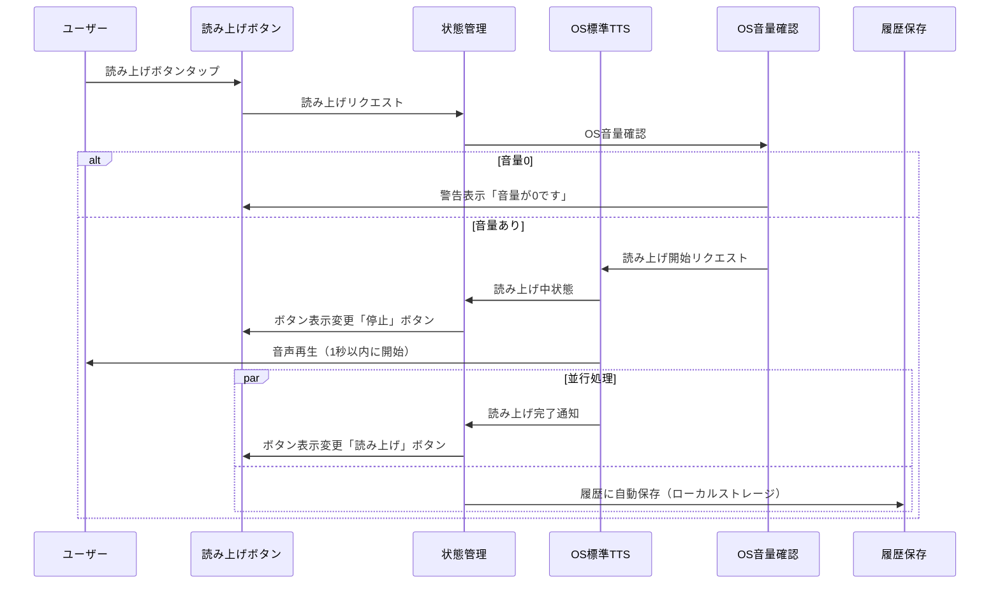

# TDD要件定義・機能仕様 - TASK-0048: OS標準TTS連携（flutter_tts）

## タスク情報

- **タスクID**: TASK-0048
- **タスク名**: OS標準TTS連携（flutter_tts）
- **タスクタイプ**: TDD
- **推定工数**: 8時間
- **フェーズ**: Phase 3 - Week 11, Day 1
- **依存タスク**: TASK-0038 (文字入力バッファ管理) ✅完了

## 関連文書

- **EARS要件定義書**: [docs/spec/kotonoha-requirements.md](../../../spec/kotonoha-requirements.md)
- **アーキテクチャ設計**: [docs/design/kotonoha/architecture.md](../../../design/kotonoha/architecture.md)
- **データフロー図**: [docs/design/kotonoha/dataflow.md](../../../design/kotonoha/dataflow.md)
- **インターフェース定義**: [docs/design/kotonoha/interfaces.dart](../../../design/kotonoha/interfaces.dart)
- **技術スタック**: [docs/tech-stack.md](../../../tech-stack.md)

---

## 1. 機能の概要（EARS要件定義書・設計文書ベース）

### 機能概要 🔵

この機能は、入力バッファのテキストをOS標準のText-to-Speech（TTS）エンジンを使用して音声で読み上げる機能を実装します。flutter_ttsパッケージを使用して、iOS/Android両プラットフォームでネイティブのTTS機能と連携し、1秒以内に読み上げを開始するパフォーマンス要件を満たします。

### 何をする機能か 🔵

- **OS標準TTSエンジンの初期化と設定**
  - flutter_ttsパッケージの初期化
  - iOS/Androidプラットフォームの自動検出と対応
  - 日本語音声の設定
  - 読み上げ速度の設定（遅い/普通/速い）

- **テキスト読み上げ機能**
  - 入力バッファのテキストを読み上げ
  - 読み上げボタンタップから1秒以内に音声出力開始
  - 読み上げ中の停止・中断機能
  - 読み上げ状態の管理（開始/再生中/停止/完了/エラー）

- **エラーハンドリング**
  - OS音量0（ミュート）時の警告
  - TTS初期化失敗時のエラー処理
  - 読み上げエラー時のフォールバック（テキスト表示のみ継続）
  - プラットフォーム非対応時の適切なメッセージ表示

### どのような問題を解決するか 🔵

**音声コミュニケーションの実現 🔵**:
- REQ-401: OS標準TTSによる読み上げ機能の提供
- REQ-402: 読み上げボタンの明確な表示
- REQ-403: 読み上げ中の停止・中断機能
- REQ-404: 読み上げ速度の3段階調整（遅い/普通/速い）

**パフォーマンス要件の達成 🔵**:
- NFR-001: TTS読み上げ開始までの時間を1秒以内に実現
- OS標準TTSエンジンを使用することでローカル処理を実現
- ネットワーク接続不要でオフライン動作を保証

**信頼性とユーザビリティ 🔵**:
- EDGE-004: TTS再生エラー時もテキスト表示で継続
- EDGE-202: 音量0時の視覚的警告表示
- NFR-301: 基本機能（文字盤+読み上げ）の継続動作を保証

### 想定されるユーザー 🔵

- **主要ユーザー**: 発話が困難で、タブレットの文字盤を使ってコミュニケーションするユーザー
- **二次ユーザー**: 介護スタッフ、家族（支援者）、医師・看護師
- **利用シーン**:
  - 自宅での家族との会話
  - 介護施設でのスタッフとのやり取り
  - 病院・診察時の医師・看護師とのコミュニケーション

### システム内での位置づけ 🔵

**アーキテクチャ上の位置**:
- **Presentation層**: TTSの状態管理とUI連携を担当
- **Domain層**: TTS読み上げのビジネスロジック（速度設定、音量確認等）
- **Infrastructure層**: flutter_ttsパッケージとのプラットフォーム連携

**依存関係**:
- **TASK-0038（文字入力バッファ管理）**: 読み上げるテキストを取得
- **後続タスク（履歴保存）**: 読み上げた内容を履歴に保存
- **後続タスク（定型文・大ボタン）**: 定型文やクイックレスポンスボタンからの即座読み上げ

**データフロー**:
```
[入力バッファ/定型文] → [TTS Service] → [OS標準TTSエンジン] → 🔊 音声出力
                             ↓
                         [履歴保存]
```

### 参照したEARS要件 🔵

- **REQ-401**: システムは入力欄のテキストをOS標準TTSで読み上げる機能を提供しなければならない
- **REQ-402**: システムは読み上げボタンを明確に表示しなければならない
- **REQ-403**: システムは読み上げ中の停止・中断機能を提供しなければならない
- **REQ-404**: システムは読み上げ速度を「遅い」「普通」「速い」の3段階から選択できなければならない

### 参照した設計文書 🔵

- **architecture.md**:
  - 「パフォーマンス」セクション（145-152行目） - TTS読み上げ1秒以内の要件
  - 「オフラインファースト設計」セクション - OS標準TTS利用でローカル処理
- **dataflow.md**:
  - 「TTS読み上げ処理」セクション（224-254行目）
- **interfaces.dart**:
  - `TTSSpeed` enum（298-319行目）
  - `InputScreenState`クラスの`isSpeaking`フィールド（469-515行目）

---

## 2. 入力・出力の仕様（EARS機能要件・TypeScript型定義ベース）

### 入力パラメータ 🔵

#### TTSService.initialize()
- **パラメータ**: なし
- **戻り値**: `Future<bool>` - 初期化成功/失敗
- **役割**:
  - flutter_ttsの初期化
  - デフォルト言語設定（日本語: "ja-JP"）
  - デフォルト読み上げ速度設定（普通: 1.0）
  - プラットフォーム固有の設定（iOS/Android）
- **エラー**: 初期化失敗時は`false`を返し、ログにエラー記録

#### TTSService.speak(String text)
- **型**: `Future<void>`
- **引数**: `String text` - 読み上げるテキスト
- **制約**:
  - 空文字列の場合は何もしない
  - 最大文字数: 1000文字（入力バッファの制限と同じ）
  - 読み上げ中に再度呼び出された場合は前の読み上げを停止してから新しいテキストを読み上げ
- **使用例**:
  ```dart
  await ttsService.speak('こんにちは');
  await ttsService.speak('お水をください');
  ```

#### TTSService.stop()
- **パラメータ**: なし
- **戻り値**: `Future<void>`
- **役割**: 現在の読み上げを即座に停止
- **制約**: 読み上げ中でない場合は何もしない

#### TTSService.setSpeed(TTSSpeed speed)
- **型**: `Future<void>`
- **引数**: `TTSSpeed speed` - 読み上げ速度（slow/normal/fast）
- **速度値**:
  - `TTSSpeed.slow`: 0.7
  - `TTSSpeed.normal`: 1.0
  - `TTSSpeed.fast`: 1.3
- **使用例**:
  ```dart
  await ttsService.setSpeed(TTSSpeed.slow);
  await ttsService.setSpeed(TTSSpeed.fast);
  ```

#### TTSService.checkVolume()
- **パラメータ**: なし
- **戻り値**: `Future<bool>` - 音量が0より大きい場合true
- **役割**: OS音量をチェックし、ミュート状態を検出
- **注意**: プラットフォームによっては正確な音量取得が困難な場合がある

### 出力値 🔵

#### TTSService state (TTSState)
- **型**: `enum TTSState { idle, speaking, stopped, completed, error }`
- **初期値**: `TTSState.idle`
- **状態遷移**:
  ```
  idle → speaking → completed → idle
       → speaking → stopped → idle
       → speaking → error → idle
  ```

#### TTSService errorMessage
- **型**: `String?`
- **初期値**: `null`
- **設定タイミング**: エラー発生時のみ
- **使用例**:
  - "TTS初期化に失敗しました"
  - "音量が0です。音量を上げてください"
  - "読み上げ中にエラーが発生しました"

### 入出力の関係性 🔵

1. **初期化フロー**:
   ```
   アプリ起動
     ↓
   TTSService.initialize()
     ↓ プラットフォーム検出（iOS/Android）
   FlutterTts.setLanguage("ja-JP")
   FlutterTts.setSpeechRate(1.0)
     ↓
   初期化完了 → state = idle
   ```

2. **読み上げフロー**:
   ```
   ユーザーが読み上げボタンタップ
     ↓
   TTSService.checkVolume() → 音量確認
     ↓（音量OK）
   TTSService.speak(text)
     ↓ state = speaking
   OS標準TTSエンジン → 音声出力（1秒以内に開始）
     ↓
   読み上げ完了 → state = completed
     ↓
   履歴に保存
   ```

3. **停止フロー**:
   ```
   ユーザーが停止ボタンタップ（読み上げ中）
     ↓
   TTSService.stop()
     ↓
   読み上げ即座に停止 → state = stopped
   ```

4. **速度変更フロー**:
   ```
   ユーザーが設定画面で速度変更
     ↓
   TTSService.setSpeed(newSpeed)
     ↓
   FlutterTts.setSpeechRate(newSpeed.value)
     ↓
   次回の読み上げから新しい速度を適用
   ```

### データフロー 🔵

```
[入力バッファProvider (inputBufferProvider)]
  ↓ 読み上げボタンタップ
[TTS State Notifier (ttsProvider)]
  ├→ checkVolume() → OS音量確認
  ├→ speak(text) → state = speaking
  └→ FlutterTts.speak(text)
       ↓
[OS標準TTSエンジン (iOS: AVSpeechSynthesizer / Android: TextToSpeech)]
  ↓ 1秒以内に音声出力開始
🔊 音声再生
  ↓ 完了通知
[TTS State Notifier]
  ├→ state = completed
  └→ 履歴保存トリガー
```

### 参照したEARS要件 🔵

- **REQ-401**: OS標準TTS読み上げ 🔵
- **REQ-403**: 停止・中断機能 🔵
- **REQ-404**: 3段階速度調整 🔵

### 参照した設計文書 🔵

- **interfaces.dart**: 298-319行目（TTSSpeed enum）
- **dataflow.md**: 224-254行目（TTS読み上げ処理シーケンス図）

---

## 3. 制約条件（EARS非機能要件・アーキテクチャ設計ベース）

### パフォーマンス要件 🔵

#### 読み上げ開始時間
- **NFR-001**: TTS読み上げ開始までの時間を1秒以内
- **測定基準**: 読み上げボタンタップから最初の音声出力まで
- **実現方法**:
  - OS標準TTSエンジンの使用（ローカル処理、ネットワーク不要）
  - 事前初期化（アプリ起動時にTTSServiceを初期化）
  - 非同期処理の最適化

#### レスポンス時間
- **NFR-003**: 文字盤タップ応答100ms以内（読み上げボタンも同様）
- **停止ボタン**: 即座に停止（100ms以内）

### 互換性・対応環境 🔵

#### プラットフォーム要件
- **NFR-401**: iOS 14.0以上、Android 10以上
- **iOS**: AVSpeechSynthesizerを使用（OS標準）
- **Android**: TextToSpeechを使用（OS標準）
- **Web**: Web Speech API（将来対応、現時点ではエラー処理のみ）

#### 音声品質
- **デフォルト言語**: 日本語（ja-JP）
- **音声エンジン**: OS標準（デバイスにプリインストールされた音声）
- **ピッチ**: デフォルト値（1.0）
- **ボリューム**: OS音量に依存（0.0 〜 1.0）

### 信頼性 🔵

#### エラーハンドリング
- **NFR-301**: 重大なエラーでも基本機能（文字盤+読み上げ）は継続動作
- **EDGE-004**: TTS再生エラー時、テキスト表示のみで継続し、エラー通知を表示
- **EDGE-202**: OS音量0時、視覚的警告を表示（「音量が0です」）

#### フォールバック処理
```dart
try {
  await ttsService.speak(text);
} catch (e) {
  // テキスト表示のみ継続
  showErrorMessage("読み上げに失敗しましたが、テキストは表示されています");
  // 履歴には保存（音声なしでも記録）
  saveToHistory(text);
}
```

### アーキテクチャ制約 🔵

**architecture.md「フロントエンド（Flutter）」セクションから抽出**:
- **状態管理**: Riverpod 2.x必須
- **StateNotifier**: TTS状態管理に使用
- **依存性注入**: TTSServiceをProviderとして提供

**flutter_ttsパッケージの制約**:
- **バージョン**: 4.2.0以上（pubspec.yamlで確認済み）
- **プラットフォーム固有設定**:
  - iOS: Info.plistにNSSpeechRecognitionUsageDescription（将来的な音声認識用）
  - Android: マニフェストに特別な権限は不要（TTS APIは標準）

### オフライン対応 🔵

- **REQ-1001**: TTS読み上げはオフライン環境で動作必須
- **実現方法**: OS標準TTSエンジンはデバイス内蔵音声を使用
- **ネットワーク**: 不要（完全オフライン動作）

### セキュリティ・プライバシー 🔵

- **NFR-101**: 読み上げテキストは端末内処理のみ（外部送信なし）
- **音声データ**: デバイス外に送信されない（OS標準TTSの特性）

### 参照したEARS要件 🔵

- **NFR-001**: TTS読み上げ開始1秒以内 🔵
- **NFR-003**: 応答時間100ms以内 🔵
- **NFR-301**: 基本機能の継続動作 🔵
- **NFR-401**: iOS/Android対応 🔵
- **REQ-1001**: オフライン動作必須 🔵
- **EDGE-004**: TTS再生エラー時のフォールバック 🟡
- **EDGE-202**: 音量0時の警告 🟡

### 参照した設計文書 🔵

- **architecture.md**: 145-152行目（パフォーマンス要件）
- **architecture.md**: 22-29行目（オフラインファースト設計）

---

## 4. 想定される使用例（EARSエッジケース・データフローベース）

### 基本的な使用パターン 🔵

#### パターン1: 文字入力からの読み上げ
**REQ-401の通常動作**:
```dart
// ユーザーが文字盤で「こんにちは」と入力
final inputBuffer = ref.read(inputBufferProvider); // "こんにちは"

// 読み上げボタンタップ
final ttsNotifier = ref.read(ttsProvider.notifier);
await ttsNotifier.speak(inputBuffer);

// 状態確認
expect(ref.read(ttsProvider).state, TTSState.speaking);

// 読み上げ完了後
expect(ref.read(ttsProvider).state, TTSState.completed);
```

#### パターン2: 定型文の即座読み上げ
**REQ-103の通常動作**:
```dart
// ユーザーが定型文「ありがとうございます」をタップ
const presetText = 'ありがとうございます';

// 即座に読み上げ（1タップで完了）
await ttsNotifier.speak(presetText);

// 1秒以内に音声出力開始
// 履歴に自動保存
```

#### パターン3: 読み上げ速度の変更
**REQ-404の通常動作**:
```dart
// 設定画面で速度を「速い」に変更
await ttsNotifier.setSpeed(TTSSpeed.fast);

// 次回の読み上げで速度が適用される
await ttsNotifier.speak('お水をください');
// → 1.3倍速で読み上げ
```

#### パターン4: 読み上げの停止
**REQ-403の通常動作**:
```dart
// 長いテキストの読み上げ開始
await ttsNotifier.speak('これは長いテキストです。読み上げには時間がかかります。');
expect(ref.read(ttsProvider).state, TTSState.speaking);

// ユーザーが停止ボタンをタップ
await ttsNotifier.stop();

// 即座に停止
expect(ref.read(ttsProvider).state, TTSState.stopped);
```

### データフロー 🔵

**dataflow.md「TTS読み上げ処理」から抽出**:


### エッジケース 🟡

#### EDGE-1: 音量0（ミュート）での読み上げ試行
**EDGE-202の動作**:
```dart
// OS音量が0の状態で読み上げボタンタップ
final volumeOk = await ttsNotifier.checkVolume();

if (!volumeOk) {
  // 視覚的警告表示
  showWarning("音量が0です。音量を上げてください");
  // 読み上げは実行しない
  return;
}

await ttsNotifier.speak(text);
```

#### EDGE-2: 読み上げ中に新しいテキストを読み上げ
```dart
// 長いテキストAを読み上げ中
await ttsNotifier.speak('これは長いテキストAです...');
expect(ref.read(ttsProvider).state, TTSState.speaking);

// ユーザーが別のテキストBの読み上げをリクエスト
await ttsNotifier.speak('新しいテキストBです');

// 動作:
// 1. テキストAの読み上げを停止
// 2. テキストBの読み上げを開始
expect(ref.read(ttsProvider).state, TTSState.speaking);
```

#### EDGE-3: 空文字列の読み上げ試行
```dart
// 空の入力バッファで読み上げボタンタップ
await ttsNotifier.speak('');

// 何も起こらない（エラーにならない）
expect(ref.read(ttsProvider).state, TTSState.idle);
```

#### EDGE-4: TTS初期化失敗
```dart
// アプリ起動時の初期化
final initSuccess = await ttsNotifier.initialize();

if (!initSuccess) {
  // エラーメッセージ表示
  showError("音声読み上げ機能の初期化に失敗しました");
  // 基本機能（文字盤+テキスト表示）は継続
  // 読み上げボタンは無効化またはグレーアウト
}
```

#### EDGE-5: プラットフォーム非対応（Web等）
```dart
// Webプラットフォームでの実行
if (Platform.isWeb) {
  // Web Speech APIを使用（将来対応）
  // 現時点ではエラーメッセージのみ
  showError("Webブラウザでは音声読み上げは現在サポートされていません");
}
```

### エラーケース 🟡

#### エラー1: TTS読み上げ中のエラー
**EDGE-004の動作**:
```dart
try {
  await ttsNotifier.speak(text);
} catch (e) {
  // エラーログ記録
  logger.error("TTS読み上げエラー: $e");

  // ユーザーへの通知
  showErrorMessage("読み上げに失敗しましたが、テキストは表示されています");

  // テキスト表示は継続
  // 履歴には保存（音声なしでも記録）
  saveToHistory(text);

  // 状態をエラーに設定
  state = state.copyWith(
    ttsState: TTSState.error,
    errorMessage: "読み上げに失敗しました",
  );
}
```

#### エラー2: 読み上げタイムアウト（1秒以内に開始しない）
```dart
// タイムアウト検出（1秒以内に開始しない場合）
final startTime = DateTime.now();

await ttsNotifier.speak(text);

final elapsedTime = DateTime.now().difference(startTime);
if (elapsedTime.inMilliseconds > 1000) {
  // パフォーマンスログ記録
  logger.warn("TTS読み上げ開始が1秒を超えました: ${elapsedTime.inMilliseconds}ms");
  // ユーザーへの影響は最小限（読み上げは継続）
}
```

### 参照したEARS要件 🔵

- **REQ-401**: OS標準TTS読み上げ 🔵
- **REQ-403**: 停止・中断機能 🔵
- **REQ-404**: 速度調整 🔵
- **EDGE-004**: TTS再生エラー時のフォールバック 🟡
- **EDGE-202**: 音量0時の警告 🟡

### 参照した設計文書 🔵

- **dataflow.md**: 224-254行目（TTS読み上げ処理シーケンス図）

---

## 5. EARS要件・設計文書との対応関係

### 参照したユーザストーリー 🔵

- **ストーリー名**: 「音声読み上げ機能（TTS）」
- **As a**: 発話が困難なユーザー
- **I want to**: 入力したテキストを音声で読み上げたい
- **So that**: 周囲の人に自分の意思を音声で伝えられる

### 参照した機能要件 🔵

| 要件ID | 要件内容 | 信頼性レベル |
|--------|----------|--------------|
| REQ-401 | システムは入力欄のテキストをOS標準TTSで読み上げる機能を提供しなければならない | 🔵 |
| REQ-402 | システムは読み上げボタンを明確に表示しなければならない | 🔵 |
| REQ-403 | システムは読み上げ中の停止・中断機能を提供しなければならない | 🔵 |
| REQ-404 | システムは読み上げ速度を「遅い」「普通」「速い」の3段階から選択できなければならない | 🔵 |
| REQ-103 | 定型文を直接タップで即座に読み上げる機能を提供しなければならない | 🔵 |
| REQ-204 | 大ボタンおよび状態ボタンのタップ時に即座に読み上げを実行しなければならない | 🟡 |
| REQ-1001 | 文字盤入力・定型文・履歴・TTSをオフライン環境で利用可能にしなければならない | 🔵 |

### 参照した非機能要件 🔵

| 要件ID | 要件内容 | 信頼性レベル |
|--------|----------|--------------|
| NFR-001 | TTS読み上げ開始までの時間を1秒以内 | 🟡 |
| NFR-003 | 文字盤タップから入力欄への文字反映まで100ms以内 | 🔵 |
| NFR-101 | 利用者の会話内容を原則として端末内にのみ保存 | 🔵 |
| NFR-301 | 重大なエラーでも基本機能（文字盤+読み上げ）は継続動作 | 🔵 |
| NFR-401 | iOS 14.0以上、Android 10以上で動作 | 🟡 |

### 参照したEdgeケース 🟡

| 要件ID | 要件内容 | 信頼性レベル |
|--------|----------|--------------|
| EDGE-004 | TTS音声再生エラー時、テキスト表示のみで継続し、エラー通知を表示 | 🟡 |
| EDGE-202 | OS音量が0（ミュート）の状態で読み上げ実行時、視覚的警告を表示 | 🟡 |
| EDGE-203 | マナーモード有効時に緊急ボタンが押された場合の警告 | 🟡 |

### 参照した設計文書 🔵

#### アーキテクチャ
- **architecture.md**:
  - 145-152行目（パフォーマンス要件 - TTS読み上げ1秒以内）
  - 22-29行目（オフラインファースト設計 - OS標準TTS利用）

#### データフロー
- **dataflow.md**:
  - 224-254行目（TTS読み上げ処理シーケンス図）

#### 型定義
- **interfaces.dart**:
  - 298-319行目（TTSSpeed enum定義）
  - 469-515行目（InputScreenState - isSpeakingフィールド）

---

## 6. 実装範囲の定義

### 実装対象 🔵

#### 本タスクで実装する機能

1. **TTSService クラス**:
   - flutter_ttsパッケージのラッパークラス
   - Riverpod StateNotifierを使用した状態管理
   - iOS/Androidプラットフォーム対応

2. **TTS初期化メソッド**:
   ```dart
   Future<bool> initialize() async {
     // flutter_ttsの初期化
     // 言語設定（ja-JP）
     // デフォルト速度設定（1.0）
     // プラットフォーム固有設定
     return true/false; // 初期化成功/失敗
   }
   ```

3. **読み上げメソッド**:
   ```dart
   Future<void> speak(String text) async {
     // 空文字チェック
     // 読み上げ中の場合は停止してから新規読み上げ
     // 音量チェック（オプション）
     // flutter_tts.speak(text)
     // 状態更新（speaking → completed）
   }
   ```

4. **停止メソッド**:
   ```dart
   Future<void> stop() async {
     // 現在の読み上げを停止
     // 状態更新（stopped）
   }
   ```

5. **速度設定メソッド**:
   ```dart
   Future<void> setSpeed(TTSSpeed speed) async {
     // flutter_tts.setSpeechRate(speed.value)
     // 状態に速度を保存
   }
   ```

6. **音量チェックメソッド**:
   ```dart
   Future<bool> checkVolume() async {
     // OS音量を取得（プラットフォーム依存）
     // 0より大きければtrue
   }
   ```

7. **状態管理**:
   - `TTSState` enum: idle, speaking, stopped, completed, error
   - `currentSpeed`: TTSSpeed
   - `errorMessage`: String?

8. **Providerの定義**:
   ```dart
   final ttsProvider = StateNotifierProvider<TTSNotifier, TTSServiceState>((ref) {
     return TTSNotifier();
   });
   ```

9. **テスト実装**:
   - 初期化テスト
   - 読み上げテスト（モック使用）
   - 停止テスト
   - 速度設定テスト
   - エラーハンドリングテスト
   - エッジケーステスト

### 実装範囲外（後続タスクで実装） 🟡

#### TASK-0049（読み上げボタンUI）で実装
- 読み上げボタンのUI実装
- 停止ボタンのUI実装
- 読み上げ中の視覚的フィードバック（アニメーション等）

#### TASK-0050（履歴保存連携）で実装
- 読み上げ完了時の履歴保存
- 履歴からの再読み上げ機能

#### 将来的な拡張（MVP範囲外）
- 音量スライダーUI
- ピッチ調整機能
- 複数音声エンジンの選択
- 音声データのカスタマイズ

---

## 7. 受け入れ基準

### 機能要件の受け入れ基準 🔵

| ID | 基準 | 検証方法 |
|----|------|----------|
| AC-001 | TTSServiceが正常に初期化される | 単体テスト |
| AC-002 | テキストを渡すと読み上げが開始される | 単体テスト（モック） |
| AC-003 | 読み上げ中にstop()を呼ぶと停止する | 単体テスト（モック） |
| AC-004 | 速度設定が正しく反映される | 単体テスト |
| AC-005 | 空文字列の読み上げ試行時は何もしない | 単体テスト |
| AC-006 | 状態が正しく遷移する（idle→speaking→completed） | 単体テスト |
| AC-007 | iOS/Android両プラットフォームで動作する | 統合テスト |

### 非機能要件の受け入れ基準 🔵

| ID | 基準 | 検証方法 |
|----|------|----------|
| AC-008 | 読み上げ開始まで1秒以内 | パフォーマンステスト（実機） |
| AC-009 | TTS初期化失敗時も基本機能は動作する | 単体テスト（エラーケース） |
| AC-010 | 読み上げエラー時もアプリはクラッシュしない | 単体テスト（エラーケース） |
| AC-011 | オフライン環境で動作する | 統合テスト |

### エッジケースの受け入れ基準 🟡

| ID | 基準 | 検証方法 |
|----|------|----------|
| AC-012 | 音量0時の警告表示（checkVolume実装） | 単体テスト |
| AC-013 | 読み上げ中に新規読み上げを開始すると前の読み上げが停止 | 単体テスト |
| AC-014 | 長いテキスト（1000文字）も正常に読み上げられる | 統合テスト |

---

## 8. 品質判定基準

### 高品質の条件

#### 要件の明確さ
- [x] TTS機能の役割が明確（OS標準TTSを使用した読み上げ）
- [x] パフォーマンス要件が具体的（1秒以内に開始）
- [x] プラットフォーム対応範囲が明確（iOS/Android）

#### 入出力定義の完全性
- [x] 初期化・読み上げ・停止・速度設定の各メソッドシグネチャが明確
- [x] 状態管理の型が明確（TTSState enum）
- [x] エラーハンドリングの方針が明確

#### 制約条件の明確さ
- [x] パフォーマンス要件: 1秒以内
- [x] プラットフォーム要件: iOS 14.0+, Android 10+
- [x] オフライン要件: ネットワーク不要
- [x] エラーハンドリング: 基本機能は継続動作

#### 実装可能性
- [x] flutter_ttsパッケージが利用可能（pubspec.yaml確認済み）
- [x] Riverpod 2.xのベストプラクティスに準拠
- [x] TASK-0038（入力バッファ）の成果物を活用
- [x] テストが実装可能（mocktailでflutter_ttsをモック化）

### 改善が必要な点

#### 音量チェックの詳細 🟡
- プラットフォームによって音量取得方法が異なる
- iOS: AVAudioSessionのoutputVolume（ただし、サイレントモードは別扱い）
- Android: AudioManagerのgetStreamVolume
- 実装時にプラットフォーム固有の制約を確認

#### Web対応 🔴
- 現時点ではWeb Speech APIの詳細は未定義
- MVP範囲外として、将来的な拡張として検討

#### ピッチ・音量調整 🔴
- MVP範囲外として、速度調整のみ実装
- ピッチ・音量のカスタマイズは将来拡張

---

## 9. 次のステップ

### 推奨コマンド
次は `/tsumiki:tdd-testcases` でテストケースの洗い出しを行います。

### テストケースで確認すべき項目

1. **初期化テスト**:
   - 初期化成功時の状態確認
   - 初期化失敗時のエラーハンドリング

2. **読み上げテスト**:
   - 通常の読み上げ
   - 空文字列の読み上げ試行
   - 読み上げ中に新規読み上げ

3. **停止テスト**:
   - 読み上げ中の停止
   - 読み上げ中でない状態での停止呼び出し

4. **速度設定テスト**:
   - slow/normal/fastの各速度設定
   - 速度変更後の読み上げ

5. **状態遷移テスト**:
   - idle → speaking → completed
   - idle → speaking → stopped
   - idle → speaking → error

6. **エラーハンドリングテスト**:
   - TTS初期化失敗
   - 読み上げ中のエラー
   - プラットフォーム非対応

7. **音量チェックテスト**:
   - 音量0の検出
   - 音量ありの確認

8. **パフォーマンステスト**:
   - 読み上げ開始時間の測定（1秒以内）

---

## 更新履歴

- **2025-11-25**: TDD要件定義書作成
  - EARS要件定義書（REQ-401, REQ-403, REQ-404, NFR-001, EDGE-004, EDGE-202）を参照
  - architecture.md、dataflow.md、interfaces.dartから設計情報を抽出
  - flutter_ttsパッケージの利用を前提とした実装詳細を定義
  - TASK-0038（文字入力バッファ管理）の成果物との連携を明記
  - 信頼性レベル（🔵🟡🔴）を各セクションに明記
