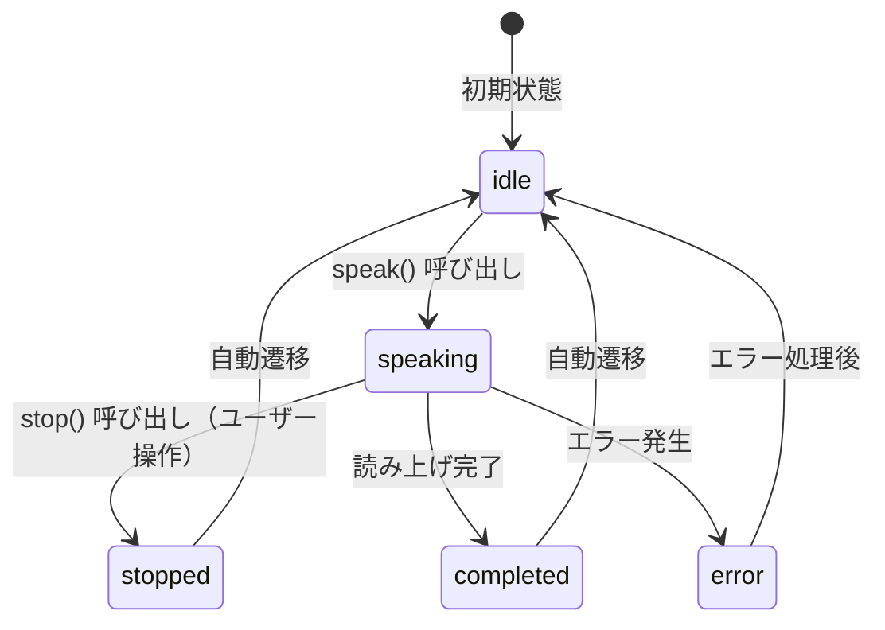

# TTS読み上げ中断機能 - 要件定義書

## タスク情報

- **タスクID**: TASK-0050
- **タスク名**: TTS読み上げ中断機能
- **関連要件**: REQ-403, REQ-3003
- **依存タスク**: TASK-0048（OS標準TTS連携）✅ 完了
- **作成日**: 2025-11-26

## 1. 機能の概要

### 1.1 機能目的 🔵

**REQ-403**: システムは読み上げ中の停止・中断機能を提供しなければならない

この機能は、TTSによるテキスト読み上げ中にユーザーが読み上げを中断できる機能を提供する。
長いテキストの読み上げ中に、ユーザーが途中で中断したい場合に必要な機能。

### 1.2 解決する問題 🔵

- 長いテキストを読み上げ中に、途中で中断したい場合がある
- 相手が理解した場合、読み上げを続ける必要がない
- 読み上げ中に別のテキストを読み上げたい場合に、現在の読み上げを停止する必要がある

### 1.3 想定ユーザー 🔵

- 発話困難な方（脳梗塞・ALS・筋疾患など）
- タブレットのタップ操作が可能な方

### 1.4 システム内での位置づけ 🔵

- **既存実装**: TASK-0048でTTSService.stop()メソッドは既に実装済み
- **未実装部分**: UI側での読み上げ中/停止ボタン切り替え、状態管理

## 2. 入力・出力の仕様

### 2.1 入力 🔵

| 項目 | 型 | 説明 |
|------|-----|------|
| ユーザー操作 | タップ | 停止ボタンをタップ |

### 2.2 出力 🔵

| 項目 | 型 | 説明 |
|------|-----|------|
| TTS停止 | void | 読み上げの即座停止 |
| 状態変更 | TTSState | speaking → stopped → idle |
| UI更新 | Widget | 停止ボタン → 読み上げボタン に切り替え |

### 2.3 状態遷移 🔵

### 2.4 参照した設計文書 🔵

- **interfaces.dart**: InputScreenState.isSpeaking フィールド（474行目）
- **tts_state.dart**: TTSState enum（stopped 状態を含む）
- **tts_service.dart**: stop() メソッド（206-212行目）

## 3. 制約条件

### 3.1 パフォーマンス要件 🟡

- **停止応答時間**: 100ms以内（NFR-003準拠）
- **UI更新**: 即座にボタン表示を切り替え

### 3.2 アクセシビリティ要件 🔵

- **タップターゲットサイズ**: 44px × 44px以上（REQ-5001）
- **推奨サイズ**: 60px × 60px以上（NFR-202）
- **視認性**: 読み上げ中/停止ボタンの状態が視覚的に明確

### 3.3 信頼性要件 🔵

- **NFR-301**: 重大なエラーでも基本機能（文字盤+読み上げ）は継続動作
- **冪等性**: 読み上げ中でない状態でstop()を呼んでもエラーにならない

### 3.4 参照した要件 🔵

- **REQ-403**: 読み上げ中の停止・中断機能
- **REQ-3003**: 読み上げ実行中状態では「停止」ボタンとして表示
- **NFR-003**: 文字盤タップから入力欄への文字反映まで100ms以内

## 4. 想定される使用例

### 4.1 正常系パターン

#### パターン1: 読み上げ中に停止 🔵

1. ユーザーがテキストを入力
2. 読み上げボタンをタップ → 読み上げ開始
3. ボタンが「停止」に変わる
4. 停止ボタンをタップ → 読み上げ中断
5. ボタンが「読み上げ」に戻る

#### パターン2: 読み上げ完了まで待機 🔵

1. ユーザーがテキストを入力
2. 読み上げボタンをタップ → 読み上げ開始
3. ボタンが「停止」に変わる
4. 読み上げが完了
5. ボタンが「読み上げ」に戻る

### 4.2 エッジケース

#### EDGE-1: アイドル状態で停止ボタンタップ 🟡

- **状況**: 読み上げ中でない状態で停止操作が行われた場合
- **期待動作**: 何も起こらない（エラーにならない）
- **参照**: tts_service.dart（stop()の冪等性設計）

#### EDGE-2: 連続タップ 🟡

- **状況**: 停止ボタンを連続でタップした場合
- **期待動作**: 1回目のタップで停止、2回目以降は何も起こらない

## 5. EARS要件・設計文書との対応関係

### 5.1 参照した機能要件 🔵

| 要件ID | 内容 | 信頼性 |
|--------|------|--------|
| REQ-403 | 読み上げ中の停止・中断機能を提供 | 🔵 |
| REQ-3003 | 読み上げ実行中は「停止」ボタンとして表示 | 🟡 |

### 5.2 参照した非機能要件 🔵

| 要件ID | 内容 | 信頼性 |
|--------|------|--------|
| NFR-003 | タップ応答100ms以内 | 🟡 |
| NFR-301 | エラー時も基本機能継続 | 🔵 |
| NFR-202 | ボタンサイズ60px×60px推奨 | 🟡 |
| REQ-5001 | タップターゲット44px×44px以上 | 🟡 |

### 5.3 参照した設計文書 🔵

| 文書 | 該当箇所 |
|------|----------|
| interfaces.dart | InputScreenState.isSpeaking（474行目） |
| tts_state.dart | TTSState enum（stopped状態） |
| tts_service.dart | stop()メソッド（206-212行目） |
| tts_provider.dart | TTSNotifier.stop()（128-131行目） |

## 6. 実装方針

### 6.1 既存実装の活用 🔵

TASK-0048で以下が既に実装済み:

- `TTSService.stop()`: 読み上げ停止メソッド
- `TTSNotifier.stop()`: Riverpod StateNotifierの停止メソッド
- `TTSState`: 状態管理enum（idle/speaking/stopped/completed/error）
- `TTSServiceState`: Riverpod状態クラス

### 6.2 新規実装が必要な部分 🔵

1. **読み上げ/停止ボタンウィジェット**: 状態に応じてボタン表示を切り替え
2. **状態監視**: TTSServiceStateのstate変更を監視してUI更新
3. **統合テスト**: ボタン操作からTTS停止までの一連のフロー

### 6.3 実装対象ファイル

| ファイル | 変更内容 |
|----------|----------|
| `lib/features/tts/presentation/widgets/tts_button.dart` | 新規作成：読み上げ/停止切り替えボタン |
| `test/features/tts/presentation/widgets/tts_button_test.dart` | 新規作成：ボタンウィジェットテスト |
| `test/integration/tts_stop_integration_test.dart` | 新規作成：統合テスト |

## 7. 品質判定

### 7.1 品質基準

| 項目 | 状態 | 備考 |
|------|------|------|
| 要件の曖昧さ | ✅ なし | REQ-403, REQ-3003で明確 |
| 入出力定義 | ✅ 完全 | 状態遷移も定義済み |
| 制約条件 | ✅ 明確 | パフォーマンス・アクセシビリティ要件あり |
| 実装可能性 | ✅ 確実 | 既存実装を活用可能 |

### 7.2 判定結果

✅ **高品質**: 次のステップに進めます

---

**次のお勧めステップ**: `/tdd-testcases` でテストケースの洗い出しを行います。
