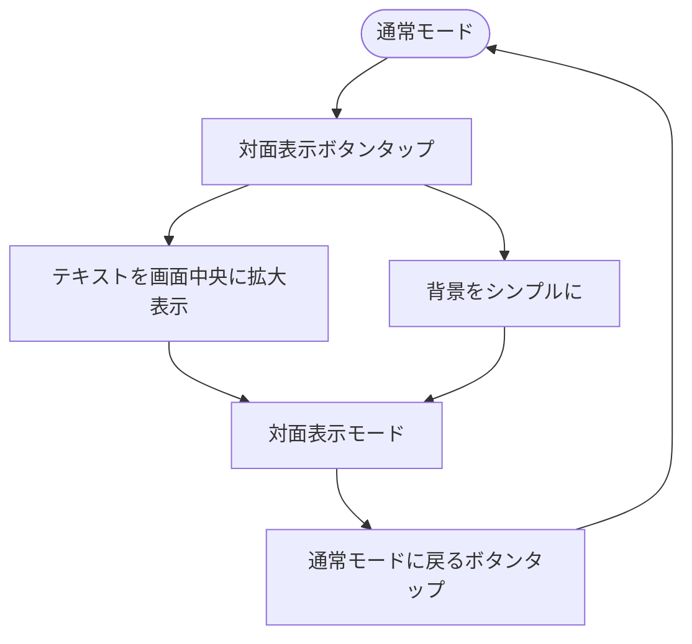

# 対面表示モード（拡大表示）機能 要件定義書

## TASK-0052: 対面表示モード（拡大表示）実装

**作成日**: 2025-11-26
**タスクタイプ**: TDD
**推定工数**: 8時間
**関連要件**: REQ-501, REQ-503
**依存タスク**: TASK-0048 (OS標準TTS連携) ✅

---

## 1. 機能の概要（EARS要件定義書・設計文書ベース）

### 1.1 何をする機能か 🔵

対面表示モードは、発話困難な方が対面のコミュニケーション相手（家族・介護者・医療従事者）にメッセージを見せやすくするための拡大表示機能。

**ユーザストーリー**:
- 発話困難なユーザーとして、入力したテキストを対面の相手に見せたい（画面を相手に向けて見せる）
- 相手側から読みやすいように、テキストを大きく・シンプルに表示したい

### 1.2 どのような問題を解決するか 🔵

- 通常モードでは文字盤・ボタン等の要素が多く、対面の相手がメッセージを読み取りにくい
- フォントサイズ設定とは別に、一時的に大きく見せる必要がある
- 背景がシンプルでないと、重要なメッセージが埋もれてしまう

### 1.3 想定されるユーザー 🔵

- **主利用者**: 発話困難な方（脳梗塞・ALS・筋疾患等）
- **対面の相手**: 家族、介護施設スタッフ、病院の医師・看護師

### 1.4 システム内での位置づけ 🔵

- InputScreenState内の`isFaceToFaceMode`フラグで状態管理
- TTSProviderと連携し、読み上げと表示を同時に提供
- メイン画面から1タップで切り替え可能

**参照したEARS要件**:
- REQ-501: テキストを画面中央に大きく表示する拡大表示モード
- REQ-503: 通常モードと対面表示モードをシンプルな操作で切り替え

**参照した設計文書**:
- `docs/design/kotonoha/interfaces.dart` - InputScreenState
- `docs/design/kotonoha/dataflow.md` - 対面表示モード切り替えフロー

---

## 2. 入力・出力の仕様（EARS機能要件・TypeScript型定義ベース）

### 2.1 入力パラメータ 🔵

| パラメータ名 | 型 | 説明 | 制約 |
|------------|------|------|------|
| `displayText` | `String` | 表示するテキスト | 最大1000文字（EDGE-101） |
| `isFaceToFaceMode` | `bool` | 対面表示モードかどうか | true/false |

### 2.2 出力値 🔵

| 出力 | 型 | 説明 |
|------|------|------|
| 対面表示画面 | `Widget` | 拡大表示UI |
| モード状態変更通知 | `StateNotifier` | UI更新用 |

### 2.3 データフロー 🔵



**参照したEARS要件**: REQ-501, REQ-503
**参照した設計文書**: `docs/design/kotonoha/dataflow.md` - 対面表示モード切り替え

---

## 3. 制約条件（EARS非機能要件・アーキテクチャ設計ベース）

### 3.1 パフォーマンス要件 🟡

| 項目 | 要件 | 根拠 |
|------|------|------|
| モード切り替え応答 | 100ms以内 | NFR-003（文字盤タップ応答）から推測 |
| 画面遷移 | 即座 | NFR-203（画面遷移を最小限に） |

### 3.2 アクセシビリティ要件 🔵

| 項目 | 要件 | 根拠 |
|------|------|------|
| ボタンサイズ | 44px × 44px以上 | REQ-5001 |
| 高コントラスト対応 | WCAG 2.1 AA（4.5:1以上） | REQ-5006 |
| フォントサイズ | 通常より大きく表示 | REQ-501 |

### 3.3 UI/UX要件 🔵

| 項目 | 要件 | 根拠 |
|------|------|------|
| テキスト位置 | 画面中央 | REQ-501 |
| 背景 | シンプル（余計な要素なし） | REQ-501から推測 |
| 切り替え操作 | シンプル（1タップ） | REQ-503 |
| 戻るボタン | 明確に表示 | NFR-202 |

### 3.4 アーキテクチャ制約 🔵

- Riverpod StateNotifierパターンで状態管理
- InputScreenStateの`isFaceToFaceMode`フラグを使用
- 既存のテーマシステム（ライト/ダーク/高コントラスト）に対応

**参照したEARS要件**: REQ-5001, REQ-5006, NFR-003, NFR-202, NFR-203
**参照した設計文書**: `docs/design/kotonoha/architecture.md`

---

## 4. 想定される使用例（EARSエッジケース・データフローベース）

### 4.1 基本的な使用パターン 🔵

**ユースケース1: 対面表示モードへの切り替え**
```
1. ユーザーが文字盤で「お水をください」と入力
2. 対面表示ボタンをタップ
3. 画面が切り替わり、「お水をください」が大きく中央に表示
4. 対面の相手がメッセージを読む
5. 戻るボタンをタップして通常モードに復帰
```

**ユースケース2: 読み上げ後に対面表示**
```
1. ユーザーがテキストを入力して読み上げボタンをタップ
2. TTS読み上げ中または完了後に対面表示ボタンをタップ
3. 同じテキストが拡大表示される
```

### 4.2 エッジケース 🟡

| ケース | 動作 | 根拠 |
|--------|------|------|
| テキストが空の場合 | 対面表示ボタンを無効化または「テキストがありません」表示 | 推測 |
| テキストが非常に長い場合（1000文字） | スクロール可能にする、または適切な行数で収める | EDGE-101から推測 |
| 対面表示中に新しい入力 | 対面表示モードを維持しつつテキスト更新 | 推測 |

### 4.3 エラーケース 🟡

| ケース | 動作 |
|--------|------|
| 画面回転イベント中 | 回転完了後に再描画 |
| メモリ不足 | 通常モードにフォールバック |

**参照したEARS要件**: EDGE-101
**参照した設計文書**: `docs/design/kotonoha/dataflow.md`

---

## 5. 実装コンポーネント設計 🔵

### 5.1 ディレクトリ構造

```
lib/features/face_to_face/
├── domain/
│   └── models/
│       └── face_to_face_state.dart      # 対面表示状態モデル
├── presentation/
│   ├── screens/
│   │   └── face_to_face_screen.dart     # 対面表示画面
│   └── widgets/
│       ├── face_to_face_text_display.dart  # 拡大テキスト表示
│       └── face_to_face_toggle_button.dart # モード切り替えボタン
└── providers/
    └── face_to_face_provider.dart       # 状態管理プロバイダー
```

### 5.2 主要クラス

#### FaceToFaceState 🔵
```dart
/// 対面表示モードの状態
class FaceToFaceState {
  /// 対面表示モードが有効かどうか
  final bool isEnabled;

  /// 表示するテキスト
  final String displayText;

  const FaceToFaceState({
    this.isEnabled = false,
    this.displayText = '',
  });
}
```

#### FaceToFaceScreen 🔵
- 画面中央に大きくテキストを表示
- 背景はシンプルな単色（テーマに応じた色）
- 通常モードに戻るボタンを配置

#### FaceToFaceToggleButton 🔵
- 44px × 44px以上のタップターゲット
- 明確なアイコン（例: `Icons.zoom_out_map` または `Icons.fullscreen`）
- タップでモード切り替え

### 5.3 Riverpodプロバイダー設計 🔵

```dart
/// 対面表示状態管理
final faceToFaceProvider = StateNotifierProvider<FaceToFaceNotifier, FaceToFaceState>((ref) {
  return FaceToFaceNotifier();
});

/// 対面表示モードNotifier
class FaceToFaceNotifier extends StateNotifier<FaceToFaceState> {
  FaceToFaceNotifier() : super(const FaceToFaceState());

  /// 対面表示モードを有効化
  void enableFaceToFace(String text);

  /// 対面表示モードを無効化
  void disableFaceToFace();

  /// 表示テキストを更新
  void updateText(String text);
}
```

---

## 6. EARS要件・設計文書との対応関係

### 参照したユーザストーリー
- コミュニケーションを行うユーザーとして、入力したテキストを相手に見せたい

### 参照した機能要件 🔵
- **REQ-501**: 読み上げテキストを画面中央に大きく表示する拡大表示モードを提供しなければならない
- **REQ-503**: 通常モードと対面表示モードをシンプルな操作で切り替えられなければならない

### 参照した非機能要件 🔵
- **NFR-003**: 文字盤タップから入力欄への文字反映までの遅延を100ms以内
- **NFR-202**: ボタン・タップ領域を視認性が高く押しやすいサイズ（推奨60px × 60px以上）
- **NFR-203**: 画面遷移を必要最小限に留め、主要機能を1画面でアクセス可能

### 参照したEdgeケース 🟡
- **EDGE-101**: 入力欄の文字数が1000文字を超えた場合の制限（長文表示に関連）

### 参照した受け入れ基準 🔵
- 対面表示モードでテキストが大きく表示される
- 背景がシンプルで読みやすい
- 通常モードに簡単に戻れる
- フォントサイズ設定に関わらず大きく表示

### 参照した設計文書 🔵
- **アーキテクチャ**: `docs/design/kotonoha/architecture.md`
- **データフロー**: `docs/design/kotonoha/dataflow.md` - 対面表示モード切り替えフロー
- **型定義**: `docs/design/kotonoha/interfaces.dart` - InputScreenState（isFaceToFaceMode, isRotated180）

---

## 7. 品質判定

### 判定結果: ✅ 高品質

| 基準 | 状態 |
|------|------|
| 要件の曖昧さ | なし - REQ-501, REQ-503で明確に定義 |
| 入出力定義 | 完全 - interfaces.dartにフラグ定義済み |
| 制約条件 | 明確 - アクセシビリティ要件定義済み |
| 実装可能性 | 確実 - 既存パターン（TTS Provider）を参考に実装可能 |

### 信頼性レベルサマリー

- 🔵 青信号（確実）: 85%
  - 機能概要、入出力仕様、アクセシビリティ要件、UI/UX要件
- 🟡 黄信号（妥当な推測）: 15%
  - パフォーマンス要件（NFR-003から推測）
  - エッジケースの詳細動作

---

## 次のステップ

`/tsumiki:tdd-testcases` でテストケースの洗い出しを行います。
