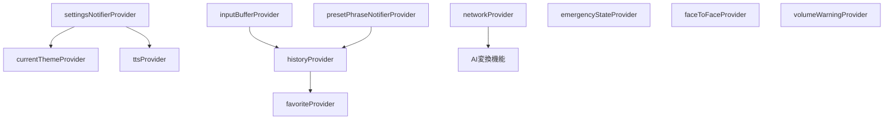

# TDD 要件定義書 - TASK-0057

## 概要
- **タスク**: Riverpod Provider 構造設計
- **フェーズ**: Requirements（要件定義）
- **実行日時**: 2025-11-26

## タスク詳細

TASK-0057は、kotonohaアプリケーション全体のRiverpod Provider構造を設計・統合するタスクです。
既存のProviderを整理し、未実装のProvider（履歴管理、お気に入り管理、ネットワーク状態管理）を追加して、
アプリケーション全体で一貫した状態管理を実現します。

## 🔵 信頼性レベル

- 🔵 **青信号**: EARS要件定義書・設計文書に明記されている
- 🟡 **黄信号**: 要件定義書から妥当な推測
- 🔴 **赤信号**: 要件定義書にない推測

---

## 機能要件

### FR-057-001: Provider階層設計 🔵
**関連要件**: アーキテクチャ設計（interfaces.dart）

Provider階層は以下の構造で設計される:

```
lib/
├── core/
│   └── themes/
│       └── theme_provider.dart          # テーマ管理
├── features/
│   ├── character_board/
│   │   └── providers/
│   │       └── input_buffer_provider.dart  # 入力バッファ管理
│   ├── preset_phrase/
│   │   └── providers/
│   │       └── preset_phrase_notifier.dart # 定型文管理
│   ├── tts/
│   │   └── providers/
│   │       ├── tts_provider.dart           # TTS状態管理
│   │       └── volume_warning_provider.dart # 音量警告管理
│   ├── settings/
│   │   └── providers/
│   │       └── settings_provider.dart      # 設定管理
│   ├── emergency/
│   │   └── presentation/
│   │       └── providers/
│   │           └── emergency_state_provider.dart # 緊急状態管理
│   ├── face_to_face/
│   │   └── providers/
│   │       └── face_to_face_provider.dart  # 対面表示モード管理
│   ├── history/
│   │   └── providers/
│   │       └── history_provider.dart       # 履歴管理 ← NEW
│   ├── favorite/
│   │   └── providers/
│   │       └── favorite_provider.dart      # お気に入り管理 ← NEW
│   └── network/
│       └── providers/
│           └── network_provider.dart       # ネットワーク状態管理 ← NEW
└── shared/
    └── providers/
        └── app_providers.dart              # Provider一覧エクスポート ← NEW
```

### FR-057-002: HistoryProvider（履歴管理） 🔵
**関連要件**: REQ-601, REQ-602, REQ-603, REQ-604

| 項目 | 内容 |
|------|------|
| Provider名 | `historyProvider` |
| 状態クラス | `HistoryState` |
| Notifier | `HistoryNotifier` |
| 機能 | 履歴の追加、削除、一覧取得、検索 |

**機能仕様**:
- `addHistory(String content, HistoryType type)` - 履歴を追加（REQ-601）
- `deleteHistory(String id)` - 履歴を削除（REQ-603）
- `getHistoryList()` - 履歴一覧を取得、新しい順に表示（REQ-602）
- `searchHistory(String query)` - 履歴を検索（REQ-604）

**完了条件**:
- 読み上げ・表示したテキストが自動的に履歴に保存される
- 履歴が新しい順に表示される
- 履歴から再度テキストを選択して読み上げできる
- 履歴の検索ができる

### FR-057-003: FavoriteProvider（お気に入り管理） 🔵
**関連要件**: REQ-701, REQ-702, REQ-703, REQ-704

| 項目 | 内容 |
|------|------|
| Provider名 | `favoriteProvider` |
| 状態クラス | `FavoriteState` |
| Notifier | `FavoriteNotifier` |
| 機能 | お気に入りの追加、削除、一覧取得、並び替え |

**機能仕様**:
- `addFavorite(String content)` - お気に入りを追加（REQ-701）
- `deleteFavorite(String id)` - お気に入りを削除（REQ-703）
- `getFavoriteList()` - お気に入り一覧を取得（REQ-702）
- `reorderFavorite(String id, int newOrder)` - 並び順を変更（REQ-704）

**完了条件**:
- 任意のテキストをお気に入りに登録できる
- お気に入りが一覧表示される
- お気に入りから再度テキストを選択して読み上げできる
- お気に入りの並び替えができる

### FR-057-004: NetworkProvider（ネットワーク状態管理） 🔵
**関連要件**: REQ-1001, REQ-1002, REQ-1003

| 項目 | 内容 |
|------|------|
| Provider名 | `networkProvider` |
| 状態 | `NetworkState` enum |
| 機能 | ネットワーク接続状態の監視、AI変換可否判定 |

**機能仕様**:
- ネットワーク接続状態を監視（オンライン/オフライン）
- オフライン時はAI変換機能を無効化（REQ-1001）
- オフライン状態を視覚的に表示（REQ-1002）
- オフライン時も基本機能（文字盤、定型文、TTS）は動作（REQ-1003）

**完了条件**:
- ネットワーク接続状態がリアルタイムで検知される
- オフライン時はAI変換ボタンが無効化される
- オフライン状態がUIに表示される
- オフライン時も基本機能が正常動作する

### FR-057-005: app_providers.dart（Provider一覧エクスポート） 🟡
**関連要件**: アーキテクチャ設計

すべてのProviderを一箇所からエクスポートし、インポートを簡素化する。

```dart
// lib/shared/providers/app_providers.dart
export 'package:kotonoha_app/features/character_board/providers/input_buffer_provider.dart';
export 'package:kotonoha_app/features/preset_phrase/providers/preset_phrase_notifier.dart';
export 'package:kotonoha_app/features/tts/providers/tts_provider.dart';
export 'package:kotonoha_app/features/settings/providers/settings_provider.dart';
export 'package:kotonoha_app/features/emergency/presentation/providers/emergency_state_provider.dart';
export 'package:kotonoha_app/features/face_to_face/providers/face_to_face_provider.dart';
export 'package:kotonoha_app/features/history/providers/history_provider.dart';
export 'package:kotonoha_app/features/favorite/providers/favorite_provider.dart';
export 'package:kotonoha_app/features/network/providers/network_provider.dart';
export 'package:kotonoha_app/core/themes/theme_provider.dart';
```

---

## Provider間の依存関係



**依存関係の説明**:
1. `currentThemeProvider` は `settingsNotifierProvider` を監視してテーマを決定
2. `ttsProvider` は `settingsNotifierProvider` からTTS速度設定を取得
3. `historyProvider` は `inputBufferProvider` と `presetPhraseNotifierProvider` から読み上げテキストを受け取り履歴に保存
4. `favoriteProvider` は `historyProvider` から選択されたテキストをお気に入りに登録
5. `networkProvider` はAI変換機能の有効/無効を制御

---

## 非機能要件

### NFR-057-001: テスト可能性 🔵
- 全Providerがモック注入可能な設計
- ProviderContainerを使用したユニットテスト対応
- 依存性注入（DI）パターンの採用

### NFR-057-002: パフォーマンス 🔵
- 状態更新は100ms以内に完了
- 不要な再描画を防ぐselect/familyの活用
- メモリリークの防止（dispose処理）

### NFR-057-003: エラーハンドリング 🔵
- 各Providerでエラー状態を管理
- エラー時もアプリがクラッシュしない
- ユーザーへの適切なエラー表示

---

## 既存Provider一覧と状態確認

| Provider | ファイル | 状態 | 備考 |
|----------|---------|------|------|
| inputBufferProvider | input_buffer_provider.dart | ✅ 実装済み | TASK-0038 |
| presetPhraseNotifierProvider | preset_phrase_notifier.dart | ✅ 実装済み | TASK-0041 |
| ttsProvider | tts_provider.dart | ✅ 実装済み | TASK-0048 |
| settingsNotifierProvider | settings_provider.dart | ✅ 実装済み | TASK-0049 |
| emergencyStateProvider | emergency_state_provider.dart | ✅ 実装済み | TASK-0046 |
| faceToFaceProvider | face_to_face_provider.dart | ✅ 実装済み | TASK-0052 |
| currentThemeProvider | theme_provider.dart | ✅ 実装済み | TASK-0016 |
| volumeWarningProvider | volume_warning_provider.dart | ✅ 実装済み | TASK-0051 |
| **historyProvider** | history_provider.dart | ❌ 未実装 | **TASK-0057** |
| **favoriteProvider** | favorite_provider.dart | ❌ 未実装 | **TASK-0057** |
| **networkProvider** | network_provider.dart | ❌ 未実装 | **TASK-0057** |

---

## 完了条件

### 必須条件
- [ ] HistoryProviderが実装され、履歴の追加・削除・一覧取得・検索が動作する
- [ ] FavoriteProviderが実装され、お気に入りの追加・削除・一覧取得・並び替えが動作する
- [ ] NetworkProviderが実装され、ネットワーク状態の監視が動作する
- [ ] app_providers.dartで全Providerがエクスポートされている
- [ ] 全Providerのユニットテストが実装され、合格している

### 品質条件
- [ ] テストカバレッジ80%以上
- [ ] 静的解析エラーなし（dart analyze）
- [ ] ドキュメントコメント付き

---

## 次のステップ

1. テストケースの洗い出し（tdd-testcases）
2. 失敗するテストの作成（tdd-red）
3. 最小限の実装（tdd-green）
4. リファクタリング（tdd-refactor）
5. 品質確認（tdd-verify-complete）
