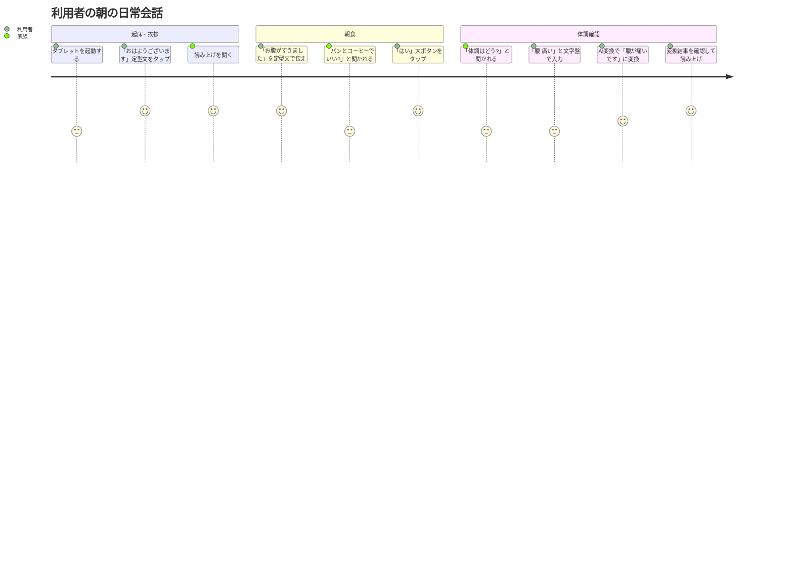
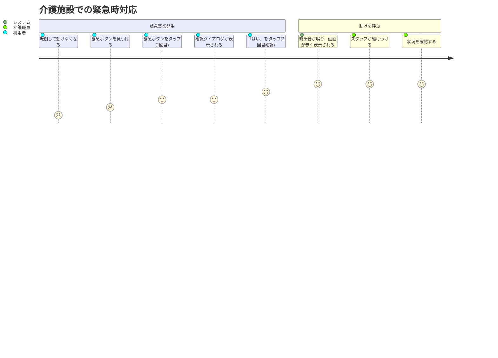
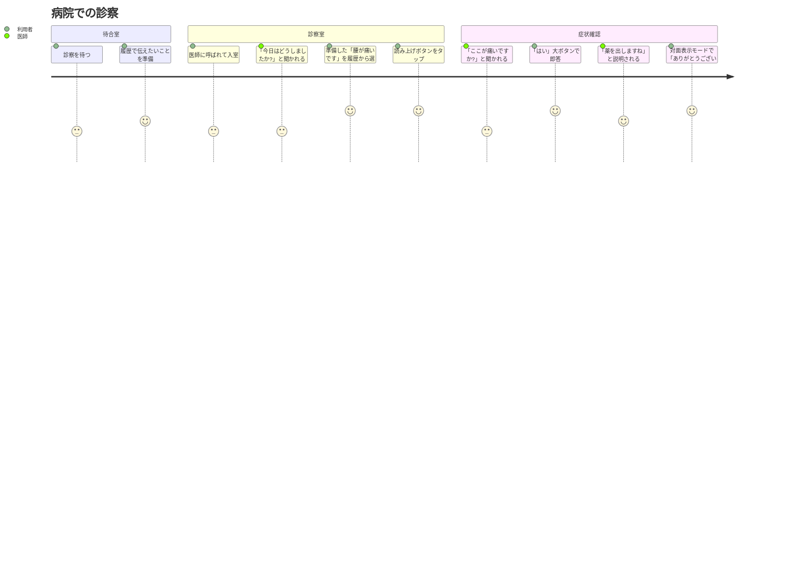

# 文字盤コミュニケーション支援アプリ（kotonoha） ユーザストーリー

## 概要

このドキュメントは文字盤コミュニケーション支援アプリ（kotonoha）の詳細なユーザストーリーを記載します。

## ユーザー種別の定義

### プライマリユーザー

- **利用者（発話困難者）**:
  - 脳梗塞・ALS・筋疾患などで発話が困難または不可能
  - 手先の動きに制約があるが、タブレットのタップ操作はある程度可能
  - 年齢層: 主に50歳以上の高齢者が多いが、若年層も含む
  - コミュニケーション手段: 現在は筆談、文字盤の指さし、簡易メモアプリなど

### セカンダリユーザー

- **家族**:
  - 在宅介護をしている家族、同居家族
  - 日常的な会話・コミュニケーションの相手
  - 定型文の初期設定・カスタマイズを支援

- **介護職員**:
  - 介護施設・デイサービスのスタッフ
  - 日常的な介護業務でのコミュニケーション
  - 利用者の要望・状態確認を迅速に行いたい

- **医療従事者**:
  - 医師・看護師・リハビリスタッフ
  - 診察時の症状確認、治療方針の説明・同意確認
  - 正確な情報伝達が必要

## ユーザストーリー

**【信頼性レベル凡例】**:
- 🔵 **青信号**: EARS要件定義書・設計文書・ユーザヒアリングを参考にした確実なストーリー
- 🟡 **黄信号**: EARS要件定義書・設計文書・ユーザヒアリングから妥当な推測によるストーリー
- 🔴 **赤信号**: EARS要件定義書・設計文書・ユーザヒアリングにない推測によるストーリー

### 📚 エピック1: 基本コミュニケーション 🔵 *mvp-requirements-original.md 5-1、ユーザヒアリング*

#### ストーリー1.1: 文字盤で自由に入力して伝える 🔵 *mvp-requirements-original.md 5-1-1*

**ユーザストーリー**:
- **私は** 発話困難な利用者 **として**
- **家族との日常会話において**
- **文字盤をタップして自由に文章を入力し、読み上げたい**
- **そうすることで** 筆談よりも速く、自分の言葉で気持ちを伝えられる

**詳細説明**:
- **背景**: 筆談は時間がかかり、手が疲れる。もっと楽に、速く会話したい
- **前提条件**: タブレットを手に持つか、テーブルに置いて使える状態
- **利用シーン**:
  - 「今日の夕飯は何がいい?」と聞かれたときに「カレーが食べたい」と伝える
  - 「暑い」「寒い」といった簡単な状態を伝える
  - 自分の考えや意見を長めの文章で伝える
- **期待する体験**:
  - 五十音の文字盤が見やすく、押しやすい大きさで表示される
  - タップすると即座に文字が入力欄に追加される
  - 誤入力してもすぐに削除できる

**関連要件**: REQ-001, REQ-002, REQ-003, REQ-004

**優先度**: 高

**見積もり**: 5ストーリーポイント

---

#### ストーリー1.2: よく使う言葉を定型文で素早く伝える 🔵 *mvp-requirements-original.md 5-1-2*

**ユーザストーリー**:
- **私は** 発話困難な利用者 **として**
- **日常的に繰り返し使う言葉を伝えるとき**
- **定型文をワンタップで選んで読み上げたい**
- **そうすることで** 毎回文字を入力する手間を省き、瞬時に意思を伝えられる

**詳細説明**:
- **背景**: 「おはよう」「ありがとう」「トイレに行きたい」など、毎日使う言葉を毎回入力するのは疲れる
- **前提条件**: よく使う定型文があらかじめ登録されている
- **利用シーン**:
  - 朝、家族に「おはようございます」と挨拶する
  - 介護職員に「お水をください」と依頼する
  - 看護師に「頭が痛いです」と症状を伝える
- **期待する体験**:
  - 定型文が見やすく一覧表示される
  - タップ1回で即座に読み上げられる
  - お気に入りの定型文は常に上部に表示される

**関連要件**: REQ-101, REQ-102, REQ-103, REQ-105

**優先度**: 高

**見積もり**: 5ストーリーポイント

---

#### ストーリー1.3: はい/いいえで即答する 🔵 *mvp-requirements-original.md 5-1-3、ユーザヒアリング*

**ユーザストーリー**:
- **私は** 発話困難な利用者 **として**
- **はい/いいえで答えられる質問をされたとき**
- **大きなボタンをワンタップで答えたい**
- **そうすることで** 相手を待たせずに即座に意思を伝えられる

**詳細説明**:
- **背景**: 「痛いですか?」「お腹すいてますか?」など、はい/いいえで答えられる質問は多い
- **前提条件**: 画面上部に常に「はい」「いいえ」「わからない」ボタンが表示されている
- **利用シーン**:
  - 医師に「ここ、痛いですか?」と聞かれて「はい」とタップ
  - 介護職員に「お風呂に入りますか?」と聞かれて「いいえ」とタップ
  - 家族に「今日はどうでしたか?」と聞かれて、答えに迷ったときに「わからない」とタップ
- **期待する体験**:
  - ボタンが大きく、どの画面でもすぐに見える
  - タップすると即座に読み上げられる
  - 押し間違えにくい配置とサイズ

**関連要件**: REQ-201, REQ-204

**優先度**: 高

**見積もり**: 3ストーリーポイント

---

### 📚 エピック2: 緊急時対応 🔵 *mvp-requirements-original.md 5-1-4*

#### ストーリー2.1: 緊急時に周囲の人を呼ぶ 🔵 *mvp-requirements-original.md 5-1-4、ユーザヒアリング*

**ユーザストーリー**:
- **私は** 発話困難な利用者 **として**
- **急に体調が悪くなったり、助けが必要になったとき**
- **緊急ボタンを押して周囲の人に知らせたい**
- **そうすることで** 声を出せなくても、すぐに助けを呼べる安心感を得られる

**詳細説明**:
- **背景**: 発話ができないため、緊急時に声で助けを呼べない。ナースコールが届かない場所でも使いたい
- **前提条件**: すべての画面で緊急ボタンが表示されている
- **利用シーン**:
  - 自宅で転倒して動けなくなったとき
  - 介護施設で急に気分が悪くなったとき
  - 夜中に家族を呼びたいとき
- **期待する体験**:
  - 緊急ボタンが常に見える場所にある
  - 誤タップを防ぐため、2回確認が必要だが、操作は簡単
  - 押すと大きな音と画面表示で周囲の人が気づきやすい

**関連要件**: REQ-301, REQ-302, REQ-303, REQ-304

**優先度**: 高（安全性に関わる）

**見積もり**: 5ストーリーポイント

---

### 📚 エピック3: 音声・視覚での伝達 🔵 *mvp-requirements-original.md 5-2*

#### ストーリー3.1: 入力した文章を読み上げてもらう 🔵 *mvp-requirements-original.md 5-2-1、ユーザヒアリング*

**ユーザストーリー**:
- **私は** 発話困難な利用者 **として**
- **文字盤や定型文で入力した文章を相手に伝えるとき**
- **読み上げボタンを押して音声で伝えたい**
- **そうすることで** 相手が文字を読む手間を省き、自然な会話に近い形で伝えられる

**詳細説明**:
- **背景**: 相手にタブレット画面を見せることもできるが、音声で伝える方が自然で、相手の負担も少ない
- **前提条件**: OS標準のTTS機能が利用可能
- **利用シーン**:
  - 家族との会話で、入力した文章を読み上げて伝える
  - 介護職員に「お水をぬるめでお願いします」と読み上げる
  - 医師に症状を音声で伝える
- **期待する体験**:
  - 読み上げボタンが分かりやすい場所にある
  - タップから1秒以内に読み上げが始まる
  - 読み上げ中に停止もできる

**関連要件**: REQ-401, REQ-402, REQ-403, NFR-001

**優先度**: 高

**見積もり**: 3ストーリーポイント

---

#### ストーリー3.2: 対面の相手に文字を見せる 🔵 *mvp-requirements-original.md 5-2-3、ユーザヒアリング*

**ユーザストーリー**:
- **私は** 発話困難な利用者 **として**
- **騒がしい場所や、音声が聞こえにくい相手とコミュニケーションするとき**
- **画面を大きく表示して、対面の相手に見せたい**
- **そうすることで** 音声に頼らず、視覚的に確実に伝えられる

**詳細説明**:
- **背景**: 周囲が騒がしい、相手が高齢で耳が遠い、などの理由で音声が伝わりにくい場合がある
- **前提条件**: 対面表示モードが利用可能
- **利用シーン**:
  - リハビリ施設の騒がしい場所でスタッフと会話
  - 耳が遠い家族とコミュニケーション
  - プライバシーが気になる場所で、音を出さずに伝えたい
- **期待する体験**:
  - 文字が大きく、相手から見やすい
  - 画面を180度回転させて相手側から正しい向きで読める
  - モード切り替えが簡単

**関連要件**: REQ-501, REQ-502, REQ-503

**優先度**: 中

**見積もり**: 5ストーリーポイント

---

### 📚 エピック4: 効率化・再利用 🔵 *mvp-requirements-original.md 5-3*

#### ストーリー4.1: 過去に使った文章を履歴から再利用する 🔵 *mvp-requirements-original.md 5-3-1、ユーザヒアリング*

**ユーザストーリー**:
- **私は** 発話困難な利用者 **として**
- **以前に使った文章をもう一度使いたいとき**
- **履歴から選んで再度読み上げたい**
- **そうすることで** 同じ文章を再入力する手間を省ける

**詳細説明**:
- **背景**: 「お水をください」など、日によって何度も使う文章がある。定型文に登録するほどではないが、履歴から選べると便利
- **前提条件**: 過去の読み上げ・表示内容が自動的に履歴として保存されている
- **利用シーン**:
  - 昨日使った「〇〇さん、お時間ありますか?」という文章を今日も使う
  - 午前中に使った「お茶をください」を午後も使う
  - 定型文にない、その日限りの文章を繰り返し使う
- **期待する体験**:
  - 履歴が時系列で見やすく表示される
  - タップ1回で再度読み上げられる
  - 古い履歴は自動的に削除されるので、管理不要

**関連要件**: REQ-601, REQ-602, REQ-603, REQ-605

**優先度**: 中

**見積もり**: 5ストーリーポイント

---

#### ストーリー4.2: よく使う文章をお気に入りに登録する 🔵 *mvp-requirements-original.md 5-3-2*

**ユーザストーリー**:
- **私は** 発話困難な利用者 **として**
- **定型文以外でよく使う文章があるとき**
- **履歴や入力した文章をお気に入りに登録して、いつでもすぐに使いたい**
- **そうすることで** 自分専用のカスタム定型文を増やせる

**詳細説明**:
- **背景**: 定型文は便利だが、自分だけが使う独特の言い回しや、状況に応じた文章を保存したい
- **前提条件**: お気に入り機能が利用可能
- **利用シーン**:
  - 「〇〇さん(担当医師の名前)、今日も診察お願いします」という、特定の人に使う文章を保存
  - 「リハビリ、今日は右手を重点的にお願いします」という、個別のリクエストを保存
  - 日によって使う、自分らしい言い回しを保存
- **期待する体験**:
  - 履歴や入力文をワンタップでお気に入りに追加できる
  - お気に入りは定型文と同じように、リスト上部に表示される
  - 並び順を変えて、よく使うものを上に配置できる

**関連要件**: REQ-701, REQ-702, REQ-703, REQ-704

**優先度**: 中

**見積もり**: 5ストーリーポイント

---

### 📚 エピック5: パーソナライゼーション 🔵 *mvp-requirements-original.md 5-4*

#### ストーリー5.1: 見やすい文字サイズに調整する 🔵 *mvp-requirements-original.md 5-4-1*

**ユーザストーリー**:
- **私は** 視力が低下している利用者 **として**
- **画面の文字が小さくて見づらいとき**
- **文字サイズを大きく変更したい**
- **そうすることで** 疲れずに画面を見て、正確に操作できる

**詳細説明**:
- **背景**: 高齢や病気で視力が低下している場合が多い。標準の文字サイズでは見づらい
- **前提条件**: 設定画面でフォントサイズが変更可能
- **利用シーン**:
  - 初回起動時に、自分に合った文字サイズを設定
  - 眼鏡をかけ忘れたときに、一時的に文字を大きくする
  - 暗い場所で使うときに、文字を大きくして見やすくする
- **期待する体験**:
  - 小/中/大の3段階から選べる
  - 設定を変えると、すぐに全画面の文字サイズが変わる
  - 標準サイズも十分に大きい

**関連要件**: REQ-801, REQ-802, REQ-804

**優先度**: 高（アクセシビリティ）

**見積もり**: 3ストーリーポイント

---

#### ストーリー5.2: 見やすい配色に変更する 🔵 *mvp-requirements-original.md 5-4-2*

**ユーザストーリー**:
- **私は** 明るい場所や暗い場所で使う利用者 **として**
- **環境に応じた見やすい配色に変更したい**
- **そうすることで** 目の疲れを減らし、快適に使える

**詳細説明**:
- **背景**: 明るい場所では白背景が見やすいが、暗い場所では眩しい。コントラストが低いと文字が読みづらい
- **前提条件**: 設定画面でテーマ（配色）が変更可能
- **利用シーン**:
  - 日中の明るい部屋ではライトモードを使用
  - 夜間や暗い部屋ではダークモードを使用
  - 視力が低い場合は高コントラストモードで文字をはっきり表示
- **期待する体験**:
  - ライト/ダーク/高コントラストの3つから選べる
  - 設定を変えると、すぐに全画面の配色が変わる
  - どのモードでも文字が見やすい

**関連要件**: REQ-803, NFR-5006

**優先度**: 中

**見積もり**: 5ストーリーポイント

---

### 📚 エピック6: AI支援 🔵 *mvp-requirements-original.md 5-6-1、ユーザヒアリング*

#### ストーリー6.1: 短い入力から丁寧な文章を作る 🔵 *mvp-requirements-original.md 5-6-1、ユーザヒアリング*

**ユーザストーリー**:
- **私は** 発話困難な利用者 **として**
- **短いキーワードや単語しか入力できないとき**
- **AIに丁寧で自然な文章に変換してもらいたい**
- **そうすることで** 相手に失礼のない、自分らしい言い方で伝えられる

**詳細説明**:
- **背景**: 長い文章を入力するのは疲れる。でも、単語だけでは失礼になったり、意味が伝わりにくい
- **前提条件**: オンライン環境、AI変換機能が有効
- **利用シーン**:
  - 「水 ぬるく」と入力 → 「お水をぬるめでお願いします」に変換
  - 「痛い 腰」と入力 → 「腰が痛いです」に変換
  - 「ありがとう 助かった」と入力 → 「ありがとうございます。とても助かりました」に変換
- **期待する体験**:
  - 入力後、自動的に変換候補が表示される
  - 変換結果を確認してから採用できる
  - 気に入らなければ、再生成または元の文を使える

**関連要件**: REQ-901, REQ-902, REQ-904

**優先度**: 中（MVP機能の中では実験的）

**見積もり**: 8ストーリーポイント

---

#### ストーリー6.2: 相手に応じて言い回しを変える 🔵 *ユーザヒアリング*

**ユーザストーリー**:
- **私は** 発話困難な利用者 **として**
- **家族と話すときと、医師と話すときで言葉遣いを変えたいとき**
- **AI変換の丁寧さレベルを選びたい**
- **そうすることで** 相手や場面に応じた適切な言葉遣いで伝えられる

**詳細説明**:
- **背景**: 家族には親しみを込めたカジュアルな言い方、医師には丁寧な言い方をしたい
- **前提条件**: AI変換機能で丁寧さレベルが選択可能
- **利用シーン**:
  - 家族との会話では「カジュアル」レベル → 「お腹すいた」
  - 介護職員との会話では「普通」レベル → 「お腹がすきました」
  - 医師との会話では「丁寧」レベル → 「お腹がすいております」
- **期待する体験**:
  - 設定画面で「カジュアル」「普通」「丁寧」を選べる
  - 選んだレベルで常に変換される
  - いつでも簡単にレベルを変更できる

**関連要件**: REQ-903

**優先度**: 低（MVP拡張機能）

**見積もり**: 5ストーリーポイント

---

### 📚 エピック7: オフライン・安定性 🔵 *mvp-requirements-original.md 5-5*

#### ストーリー7.1: ネットワークがなくても基本機能を使う 🔵 *mvp-requirements-original.md 5-5-1*

**ユーザストーリー**:
- **私は** 発話困難な利用者 **として**
- **Wi-Fiや通信環境がない場所でも**
- **基本的なコミュニケーション機能を使いたい**
- **そうすることで** どこでも安心して使える

**詳細説明**:
- **背景**: 病院の診察室や、地下の施設など、ネットワークが不安定な場所でも使いたい
- **前提条件**: オフライン対応機能が実装されている
- **利用シーン**:
  - Wi-Fiのない病室で看護師とコミュニケーション
  - 外出先でネットワークに接続できないときも、定型文と文字盤で会話
  - 災害時など、通信インフラが止まった状況でも使用
- **期待する体験**:
  - 文字盤、定型文、履歴、読み上げは常に使える
  - オフライン時はAI変換が使えないことが分かる
  - オフライン時でも、元の文をそのまま使える

**関連要件**: REQ-1001, REQ-1002, REQ-1003, NFR-303

**優先度**: 高

**見積もり**: 8ストーリーポイント

---

## ユーザージャーニー

### ジャーニー1: 朝の日常会話（利用者と家族） 🔵 *mvp-requirements-original.md 想定シーンより*

**詳細**:
1. **タブレットを起動する**: アプリを開くと、前回の画面状態が復元される
2. **「おはようございます」定型文をタップ**: お気に入り定型文から選択、即座に読み上げ
3. **読み上げを聞く**: 家族が音声を聞いて「おはよう」と返す
4. **「お腹がすきました」を定型文で伝える**: 定型文一覧から選択
5. **「はい」大ボタンをタップ**: 画面上部の大ボタンで即答
6. **「腰 痛い」と文字盤で入力**: 短い入力で時間を節約
7. **AI変換で「腰が痛いです」に変換**: 自動で丁寧な文章に変換
8. **変換結果を確認して読み上げ**: 変換結果をチェックし、読み上げボタンをタップ

---

### ジャーニー2: 介護施設での緊急対応 🔵 *mvp-requirements-original.md 5-1-4*

**詳細**:
1. **転倒して動けなくなる**: 利用者が予期せぬ事態に遭遇
2. **緊急ボタンを見つける**: どの画面でも常に表示されている緊急ボタンを発見
3. **緊急ボタンをタップ(1回目)**: 誤操作防止のため、まず確認ダイアログが表示
4. **「はい」をタップ(2回目確認)**: 本当に緊急呼び出しを実行するか確認
5. **緊急音が鳴り、画面が赤く表示される**: 周囲の人が気づきやすい音と視覚的表示
6. **スタッフが駆けつける**: 緊急音を聞いたスタッフが急行

---

### ジャーニー3: 病院での診察（利用者と医師） 🔵 *mvp-requirements-original.md 2-1*

**詳細**:
1. **履歴で伝えたいことを準備**: 待ち時間に、今日の症状を入力し、履歴に保存
2. **準備した「腰が痛いです」を履歴から選択**: 診察時に履歴から素早く呼び出し
3. **読み上げボタンをタップ**: 医師に音声で症状を伝える
4. **「はい」大ボタンで即答**: 質問に素早く反応
5. **対面表示モードで「ありがとうございます」を見せる**: 医師に画面を向けて、文字を大きく表示

---

## ペルソナ定義

### ペルソナ1: 田中太郎さん（70歳、脳梗塞後の失語症） 🔵 *mvp-requirements-original.md 2-2*

- **基本情報**:
  - 年齢: 70歳、男性
  - 病歴: 3年前に脳梗塞を発症、右半身麻痺と失語症
  - 居住: 自宅で妻と二人暮らし
  - 技術レベル: スマートフォンは使えるが、細かい操作は苦手

- **ゴール**:
  - 妻との日常会話をもっとスムーズにしたい
  - 病院での診察時に、自分の症状を正確に伝えたい
  - 孫とも会話を楽しみたい

- **課題**:
  - 筆談は手が疲れて長続きしない
  - 言いたいことがあるのに伝えられず、ストレスを感じる
  - 緊急時に妻を呼べるか不安

- **行動パターン**:
  - 毎朝、妻に挨拶をしたい
  - 食事の希望や体調を伝えたい
  - 週1回の通院で医師に症状を報告

- **利用環境**:
  - デバイス: 10インチタブレット（iPad）
  - 場所: 自宅リビング、病院診察室
  - 時間帯: 朝・昼・夕方の家族との会話時間

---

### ペルソナ2: 佐藤花子さん（55歳、ALS患者） 🔵 *mvp-requirements-original.md 2-2*

- **基本情報**:
  - 年齢: 55歳、女性
  - 病歴: 2年前にALSと診断、進行性の筋力低下
  - 居住: 介護施設に入所
  - 技術レベル: パソコン・スマートフォンに慣れている

- **ゴール**:
  - 自分らしい言葉で気持ちを伝えたい
  - 介護職員とのコミュニケーションを円滑にしたい
  - 家族との面会時に、たくさん会話したい

- **課題**:
  - 筋力低下で声が出せず、文字を書くことも困難
  - 既存の文字盤は使いにくく、疲れる
  - 自分の気持ちを丁寧に伝えたいが、長文入力は疲れる

- **行動パターン**:
  - 毎日、介護職員に食事や入浴の希望を伝える
  - 週末の家族面会時に、その週の出来事を話す
  - リハビリスタッフに要望を伝える

- **利用環境**:
  - デバイス: Androidタブレット（11インチ）
  - 場所: 介護施設の個室、面会室、リハビリ室
  - 時間帯: 朝・昼・夕の介護時間、週末の面会時間

---

## 非機能的ユーザー要求

### ユーザビリティ要求

- **学習容易性**:
  - 初回起動時に簡単なチュートリアルを見るだけで基本操作を理解できる
  - 支援者（家族・介護職員）が5分程度の説明で使い方を教えられる
  - 🟡 *mvp-requirements-original.md 3、6-1から推測*

- **効率性**:
  - よく使う操作（定型文選択、読み上げ）を3タップ以内で完了できる
  - 緊急ボタンを5秒以内に押せる
  - 🟡 *mvp-requirements-original.md 3、NFR-201から推測*

- **記憶しやすさ**:
  - 一度覚えた操作を、数日使わなくても忘れずに実行できる
  - ボタンの配置が一貫していて、直感的に操作できる
  - 🟡 *mvp-requirements-original.md 6-1から推測*

- **エラー対応**:
  - 誤操作（全消去、お気に入り削除など）をしても、確認ダイアログで取り消せる
  - エラーが発生しても、分かりやすいメッセージで対処方法が分かる
  - 🔵 *mvp-requirements-original.md 6-1、6-4*

- **満足度**:
  - 利用者が「自分の言葉で伝えられた」と感じられる
  - 相手とのコミュニケーションが以前よりスムーズになったと感じられる
  - 🔵 *mvp-requirements-original.md 1-2*

### アクセシビリティ要求

- **視覚**:
  - 低視力の利用者でも、フォントサイズを大きくして読める
  - 高コントラストモードで、文字と背景の区別が明確
  - 🔵 *mvp-requirements-original.md 5-4-1、5-4-2*

- **聴覚**:
  - 音声が聞こえなくても、対面表示モードで視覚的に伝えられる
  - 緊急ボタンは音声だけでなく、画面表示でも通知
  - 🔵 *mvp-requirements-original.md 5-2-3、5-1-4*

- **運動**:
  - 手の動きに制約があっても、大きなボタンでタップしやすい
  - スワイプなどの複雑なジェスチャーを使わず、タップのみで完結
  - 🔵 *mvp-requirements-original.md 6-1*

- **認知**:
  - シンプルな画面構成で、迷わず操作できる
  - 画面遷移を最小限に抑え、認知負荷を減らす
  - 🔵 *mvp-requirements-original.md 3、5-5-2*
