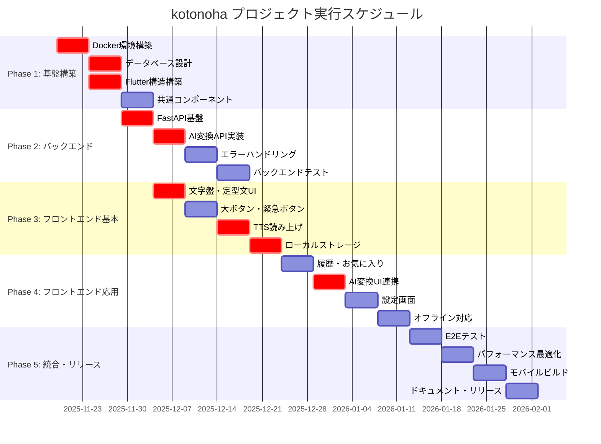

# 文字盤コミュニケーション支援アプリ（kotonoha） タスク実装計画 - 全体概要

## 要件名

**kotonoha** - 文字盤コミュニケーション支援アプリ

発話困難な方が「できるだけ少ない操作で、自分の言いたいことを、適切な丁寧さで、安全に伝えられる」ことを目的としたタブレット向けコミュニケーション支援アプリ。

## プロジェクト概要

- **開発期間**: 約100営業日（5ヶ月）
- **総工数**: 約800時間
- **総タスク数**: 100タスク
- **技術スタック**: Flutter 3.38.1 + FastAPI 0.121 + PostgreSQL 15 + AWS CDK 2.x

## 🔵 信頼性レベルについて

各タスクとフェーズでは、以下の信号で元の資料（EARS要件定義書・設計文書）との照合状況を示しています:

- 🔵 **青信号**: EARS要件定義書・設計文書を参考にしてほぼ推測していない場合
- 🟡 **黄信号**: EARS要件定義書・設計文書から妥当な推測の場合
- 🔴 **赤信号**: EARS要件定義書・設計文書にない推測の場合

### 全体の信頼性レベル評価

- **Phase 1 (開発環境構築・基盤実装)**: 🟡 黄信号
  - 技術スタック定義書に基づいているが、具体的な実装手順は推測を含む
- **Phase 2 (バックエンドAPI実装)**: 🔵 青信号
  - API設計書・データベーススキーマに明確に記載されている
- **Phase 3 (フロントエンド基本機能実装)**: 🔵 青信号
  - 要件定義書・インターフェース定義に明確に記載されている
- **Phase 4 (フロントエンド応用機能実装)**: 🔵 青信号
  - 要件定義書に明確に記載されている
- **Phase 5 (統合・テスト・リリース準備)**: 🟡 黄信号
  - テスト戦略は要件定義書から推測、E2Eシナリオは具体的に記載なし

## フェーズ構成

| フェーズ | 期間 | 成果物 | タスク数 | 工数 | ファイル |
|---------|------|--------|---------|------|---------|
| Phase 1 | Week 1-4 (20日) | 開発環境構築・基盤実装 | 20タスク | 160時間 | [kotonoha-phase1.md](./kotonoha-phase1.md) |
| Phase 2 | Week 5-8 (20日) | バックエンドAPI実装 | 16タスク | 128時間 | [kotonoha-phase2.md](./kotonoha-phase2.md) |
| Phase 3 | Week 9-12 (20日) | フロントエンド基本機能実装 | 24タスク | 192時間 | [kotonoha-phase3.md](./kotonoha-phase3.md) |
| Phase 4 | Week 13-16 (20日) | フロントエンド応用機能実装 | 20タスク | 160時間 | [kotonoha-phase4.md](./kotonoha-phase4.md) |
| Phase 5 | Week 17-20 (20日) | 統合・テスト・リリース準備 | 20タスク | 160時間 | [kotonoha-phase5.md](./kotonoha-phase5.md) |

## タスクID管理

### 使用済みタスク番号

- **Phase 1**: TASK-0001 〜 TASK-0020
- **Phase 2**: TASK-0021 〜 TASK-0036
- **Phase 3**: TASK-0037 〜 TASK-0060
- **Phase 4**: TASK-0061 〜 TASK-0080
- **Phase 5**: TASK-0081 〜 TASK-0100

### 次回開始番号

- **次のタスク**: TASK-0101

## 全体進捗

### Phase 1: 開発環境構築・基盤実装
- [x] TASK-0001: Gitリポジトリ初期設定 (2025-11-19完了)
- [ ] Week 1: プロジェクト初期設定・Docker環境構築 (1/5タスク完了)
- [ ] Week 2: データベース設計・マイグレーション
- [ ] Week 3: Flutter プロジェクト構造構築
- [ ] Week 4: 共通コンポーネント・ユーティリティ実装

### Phase 2: バックエンドAPI実装
- [ ] Week 5: FastAPI基盤構築・認証設定
- [ ] Week 6: AI変換API実装
- [ ] Week 7: エラーハンドリング・ロギング
- [ ] Week 8: バックエンドテスト・API文書化

### Phase 3: フロントエンド基本機能実装
- [ ] Week 9: 文字盤・定型文UI実装
- [ ] Week 10: 大ボタン・緊急ボタン実装
- [ ] Week 11: TTS読み上げ・対面表示モード
- [ ] Week 12: ローカルストレージ・状態管理

### Phase 4: フロントエンド応用機能実装
- [ ] Week 13: 履歴管理・お気に入り機能
- [ ] Week 14: AI変換連携UI
- [ ] Week 15: 設定画面・アクセシビリティ
- [ ] Week 16: オフライン対応・エラーハンドリング

### Phase 5: 統合・テスト・リリース準備
- [ ] Week 17: E2Eテスト・品質確認
- [ ] Week 18: パフォーマンス最適化
- [ ] Week 19: モバイルビルド・デプロイ設定
- [ ] Week 20: ドキュメント整備・リリース準備

## マイルストーン

### M1: 開発環境完成（Week 4終了時）
- Docker環境でバックエンド・フロントエンドが起動する
- データベースマイグレーションが動作する
- 基本的なCI/CDパイプラインが動作する

### M2: バックエンドAPI完成（Week 8終了時）
- AI変換APIが正常に動作する
- Swagger UIでAPI文書が参照できる
- バックエンドテストカバレッジ90%以上

### M3: フロントエンド基本機能完成（Week 12終了時）
- 文字盤入力・TTS読み上げが動作する
- 定型文・大ボタンが動作する
- ローカルストレージでデータ永続化が動作する

### M4: 全機能実装完了（Week 16終了時）
- 履歴・お気に入り機能が動作する
- AI変換連携が動作する
- オフライン対応が完了している

### M5: リリース準備完了（Week 20終了時）
- E2Eテスト合格
- iOS/Android/Webビルドが成功する
- ユーザードキュメントが完成している

## クリティカルパス

1. **Docker環境構築** → データベース設計 → バックエンドAPI実装
2. **Flutter基盤構築** → ローカルストレージ実装 → 基本UI実装
3. **AI変換API実装** → AI変換UI連携

## 並行実行可能なタスクグループ

### グループA: バックエンド系（Week 5-8）
- FastAPI実装
- PostgreSQL設定
- AI変換API開発

### グループB: フロントエンド系（Week 9-16）
- Flutter UI実装
- ローカルストレージ実装
- 状態管理実装

## 品質基準

- **コードカバレッジ**: 全体80%以上、ビジネスロジック90%以上
- **パフォーマンス**:
  - TTS読み上げ開始: 1秒以内
  - 文字盤タップ応答: 100ms以内
  - AI変換応答: 平均3秒以内
- **アクセシビリティ**: WCAG 2.1 AAレベル準拠
- **コード品質**: Flutter lints、Ruff + Black準拠

## リスク管理

### 高リスク項目
1. **AI API連携の安定性**: 外部APIの応答時間・エラー率
   - 対策: タイムアウト設定、フォールバック処理、リトライ機構
2. **オフライン対応の複雑さ**: ネットワーク状態管理
   - 対策: 早期に基本フロー実装、段階的な機能追加
3. **TTS動作の端末依存性**: OS標準TTSの挙動差異
   - 対策: 複数端末でのテスト、エラーハンドリング強化

### 中リスク項目
1. **パフォーマンス要件達成**: 100ms応答、1秒TTS開始
   - 対策: 早期性能テスト、プロファイリング
2. **アクセシビリティ対応**: フォントサイズ・コントラスト比
   - 対策: 設計段階からWCAG基準を考慮

## 実行順序（Mermaidガントチャート）

以下のガントチャートは、各フェーズとクリティカルパスを可視化したものです:

### クリティカルパスの詳細

1. **環境構築パス**: Docker環境 → DB設計 → FastAPI基盤 → AI変換API (Week 1-6)
2. **基本UI構築パス**: Flutter構造 → 共通コンポーネント → 文字盤UI → TTS → ローカルストレージ (Week 3-12)
3. **統合パス**: AI変換API + ローカルストレージ → AI変換UI連携 → E2Eテスト → リリース (Week 6-20)

## 関連ドキュメント

- [要件定義書](../../spec/kotonoha-requirements.md)
- [ユーザストーリー](../../spec/kotonoha-user-stories.md)
- [受け入れ基準](../../spec/kotonoha-acceptance-criteria.md)
- [アーキテクチャ設計](../design/kotonoha/architecture.md)
- [データフロー図](../design/kotonoha/dataflow.md)
- [APIエンドポイント仕様](../design/kotonoha/api-endpoints.md)
- [データベーススキーマ](../design/kotonoha/database-schema.sql)
- [技術スタック定義](../tech-stack.md)

## 更新履歴

- **2025-11-19**: 初回作成（tsumiki:kairo-tasks により自動生成）
- **2025-11-19**: タスク検証完了（tsumiki:kairo-task-verify により更新）
  - 信頼性レベルセクション追加
  - Mermaidガントチャート追加
  - クリティカルパスの詳細追加
